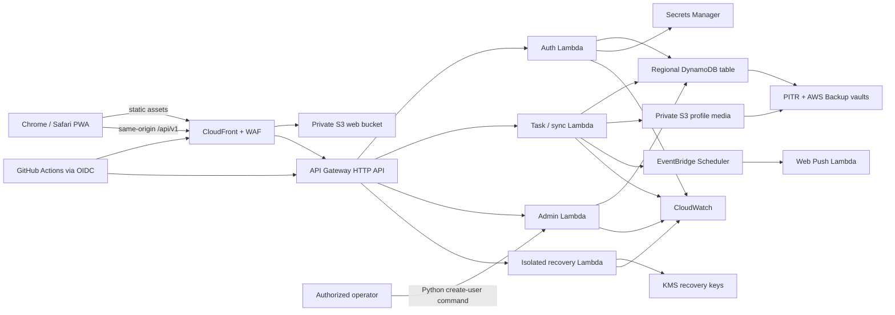

# Implementation Plan: Na'aseh v1 Baseline

**Branch**: `001-naaseh-v1-baseline` | **Date**: 2026-07-23 | **Spec**: [spec.md](./spec.md)

**Input**: Feature specification from `/specs/001-naaseh-v1-baseline/spec.md`

## Summary

Build Na'aseh as an installable React/TypeScript progressive web application with an
offline IndexedDB data layer, explicit outbox synchronization, local authorized full-text
search, responsive list and post-it views, and offline PIN-based decryption for hidden
memos. Serve the application through CloudFront and private S3, expose a same-origin HTTP
API backed by bounded Node.js Lambda functions, and persist current state plus immutable
revision/sync records in one on-demand regional DynamoDB table. Provide an IAM-authorized
Python command in `scripts/` to bootstrap or add a user with an explicit application role.

Custom authentication uses Argon2id and revocable opaque sessions. Hidden memos use
browser-side AES-GCM with a random per-memo data key, a PIN-derived offline wrap, and
AWS KMS recovery wraps. All Region-scoped v1 AWS resources stay in `us-west-2`; DynamoDB PITR, S3
versioning, a locked AWS Backup vault, retained single-Region KMS keys, signed backup
manifests, and quarterly isolated restore tests protect data and cryptographic dependencies
without deploying a duplicate live or passive architecture.

### Architecture



## Technical Context

**Language/Version**: TypeScript 5.x for the application and infrastructure; React 19 in the
browser; Node.js 24 (`nodejs24.x`) on AWS Lambda; Python 3.12+ for `scripts/create_user.py`

**Primary Dependencies**: React, Vite, Workbox via `vite-plugin-pwa`, Dexie, MiniSearch,
Zod, AWS SDK v3, the workspace `@naaseh/observability` structured logging/metrics package, `@node-rs/argon2`, a pinned
Argon2id WebAssembly implementation for PIN derivation, AWS CDK v2, Web Crypto API; Python
standard library `argparse`/`getpass` plus Boto3 for the user-provisioning command

**Storage**: One `us-west-2` DynamoDB on-demand table for application state and immutable revisions;
IndexedDB for encrypted browser cache/outbox; private S3 for profile pictures and static
assets; AWS Backup vaults, DynamoDB PITR, Secrets Manager, and KMS for recovery dependencies

**Testing**: Vitest unit/component tests, property tests for merge/idempotency rules,
DynamoDB Local or isolated AWS integration tests, contract tests generated from OpenAPI,
Playwright Chromium/WebKit end-to-end tests, axe accessibility checks, Lambda performance
tests, and quarterly isolated restore validation

**Target Platform**: Installable responsive web application; one AWS deployment Region,
`us-west-2`, with no live or passive secondary-Region architecture in v1

**Supported Browsers**: Current stable Chrome and Safari/WebKit; current and previous major
macOS Safari for release validation; supported iPhone/iPad Safari and installed Home Screen
mode, with exact minimum OS fixed in implementation after real-device validation

**Project Type**: Predominantly TypeScript monorepo containing a browser PWA, serverless API,
shared contracts/domain packages, and infrastructure as code, plus one bounded Python
administrative command under `scripts/`

**Performance Goals**: UI acknowledgement within 1 second p95; sign-in within 2 seconds p95;
Argon2id verification at or below 1 second p95; local search/filter within 1 second p95;
API read/write handlers under 500 ms p95 excluding calibrated password hashing

**Constraints**: Lowest reasonable AWS cost; all production Region-scoped resources in
`us-west-2`, selected by `NAASEH_AWS_REGION` (default `us-west-2`, production rejects any
other value); global edge services do not authorize a second Regional workload; no
duplicate multi-Region application/data architecture; no OpenSearch in v1; no plaintext passwords,
PINs, hidden memos, sessions, or recovery keys in logs/storage; five-minute RPO; four-hour
RTO; detailed CloudWatch logging with `VERBOSE_LOGGING` true only for literal `true`

**Offline Strategy**: IndexedDB is the browser source of UI truth. Each local mutation and
its immutable outbox record commit atomically. Sync uses client mutation IDs, idempotency,
record versions, a server change cursor, retry with jitter, and explicit 409 conflicts.
Service workers precache only the application shell; authenticated API data stays in the
encrypted IndexedDB vault. Background Sync is an optional enhancement, never a dependency.

**Security & Data Boundaries**: Public tasks are visible to all active users; private tasks
and revisions are owner-only. Group membership controls participation, not non-private task
visibility. V1 uses discoverable self-join groups without targeted invitations; successful
join is explicit acceptance, owners can revoke membership, and task group association is
organizational only. It grants neither private visibility nor task mutation authority.
Opaque sessions remain in Secure, HttpOnly, SameSite=Strict `__Host-` cookies.
All cached records use a device-local non-extractable encryption key. Hidden memo plaintext
exists only in browser memory after PIN unlock. Recovery decrypt permission exists only in
a dedicated recovery role/function and is an accepted AWS trust-boundary tradeoff. The
application `admin` role may manage users and categories but never bypasses ordinary task,
group, private-data, or hidden-memo authorization. The Python command uses an IAM-authorized
backend invocation; it never accepts a password as a command-line argument.

**AWS Architecture & Cost Impact**: Use an edge-control stack in `us-east-1` for the CloudFront
certificate and CloudFront-scope WAF. In `us-west-2`, use CloudFront, S3, API Gateway HTTP
API, Lambda, one DynamoDB on-demand table, EventBridge Scheduler, single-Region KMS keys,
Secrets Manager, CloudWatch, AWS Backup, and a small Step Functions restore-validation
workflow. Request volume, Lambda GB-seconds (especially Argon2), backup storage, Secrets
Manager/KMS key charges, CloudWatch ingestion/retention, and restore tests are principal cost
drivers. Global tables, replicated secrets/keys, OpenSearch, and always-on compute are
rejected for v1.

**CloudWatch Observability**: Structured JSON includes request/correlation/client-mutation
IDs, safe actor/resource IDs, operation, outcome, latency, retry/conflict classification,
and error class. App logs retain 30 days; auth/recovery/audit logs retain 90 days, with
longer audit export only if later required. Metrics and alarms cover authentication abuse,
API errors/latency, Lambda throttling/duration, DynamoDB errors, sync
conflicts/backlog, KMS/Secrets policy or deletion events, backup failures, and restore tests.

**Scale/Scope**: Initial single workspace, up to 50 provisioned users, 50,000 active tasks,
500,000 retained revisions, and modest daily mutation volume. Revisit search and partition
sharding before exceeding these planning bounds.

## Constitution Check

_GATE: Passed before Phase 0 research and re-checked after Phase 1 design._

- **Security and data boundaries — PASS**: Authorization is enforced in DynamoDB access
  patterns and handlers; private data is never fetched then filtered for unauthorized users.
  Password, session, PIN, memo, recovery, and administrative trust boundaries are explicit.
- **Data durability and observability — PASS**: Atomic mutations, immutable revisions,
  idempotent sync, same-Region PITR and locked backups, retained cryptographic recovery
  packages, structured logs, alarms, and quarterly isolated restores are designed. Total
  `us-west-2` loss is outside the explicitly bounded v1 recovery scope.
- **Browser offline operation and resynchronization — PASS**: IndexedDB, an atomic outbox,
  foreground-triggered drain, explicit conflicts, durable cursors, and visible states cover
  offline operation without assuming unsupported background execution.
- **Supported browsers — PASS**: Playwright covers Chromium and WebKit profiles; release
  validation adds real Safari/iPhone/iPad ordinary-tab and Home Screen checks.
- **Automated testing — PASS**: Unit, property, integration, contract, security,
  performance, browser, accessibility, and restore tests are planned.
- **Performance and AWS architecture — PASS**: All compute is serverless; DynamoDB and S3
  are managed/on-demand; measurable budgets, cost drivers, and rejected always-on
  alternatives are documented.
- **Simplicity, review, comments, and documentation — PASS**: The application remains a
  TypeScript monorepo; the requested Python CLI is isolated under `scripts/` and reuses the
  backend provisioning boundary. Removing duplicate Regional resources reduces current cost
  and operational complexity while retaining backup and restore tests.

### Post-Design Re-check

Phase 1 contracts keep authorization server-side, define the Python command and admin rights,
make sync conflicts explicit, never persist hidden-memo search tokens, and require recovery
key references in backup manifests. The one-Region limitation and deferred Region-loss
recovery are explicit; no constitutional gate is unresolved.

## Key Technical Decisions

1. Use local-first UI state without claiming an offline-first backend architecture.
2. Use optimistic concurrency and explicit conflicts; never silent last-write-wins for user text.
3. Search the fully synchronized authorized working set locally; do not add OpenSearch in v1.
4. Use opaque revocable sessions instead of JWTs for the single backend.
5. Use a PIN wrap for offline use and a retained single-Region KMS recovery wrap for backups.
6. Deploy the live architecture and backup resources only in `us-west-2`; use
   `NAASEH_AWS_REGION`, defaulted and production-locked to that Region, with no global table
   or failover stack.
7. Expose user/category administration only to the application `admin` role; admin never
   overrides task ownership or private/hidden content boundaries.
8. Provide `scripts/create_user.py`, using a secure password prompt or standard input and an
   IAM-authorized provisioning Lambda invocation; never accept secrets in process arguments.
9. Treat closed-and-offline reminder delivery as a browser limitation, not a false guarantee.
10. Use one deployable `NaasehStack` for v1 to minimize cross-stack references and operational
    overhead. Files named for web, API, data, observability, and recovery concerns are helper
    constructs or policy modules, not independently deployed stacks, unless scale later creates
    a concrete need to split them.

## Project Structure

### Documentation (this feature)

```text
specs/001-naaseh-v1-baseline/
├── plan.md
├── research.md
├── data-model.md
├── quickstart.md
├── contracts/
│   ├── openapi.yaml
│   ├── create-user-cli.md
│   ├── sync-protocol.md
│   └── cryptography.md
└── tasks.md
```

### Source Code (repository root)

```text
apps/
├── web/
│   ├── public/
│   └── src/
│       ├── app/
│       ├── components/
│       ├── crypto/
│       ├── db/
│       ├── features/
│       ├── notifications/
│       ├── search/
│       ├── styles/
│       └── sync/
└── api/
    └── src/
        ├── admin/
        ├── auth/
        ├── categories/
        ├── crypto-recovery/
        ├── groups/
        ├── notifications/
        ├── shared/
        ├── sync/
        └── tasks/

packages/
├── contracts/
├── domain/
├── observability/
└── test-fixtures/

infra/
├── bin/
├── lib/
│   ├── naaseh-stack.ts       # single deployable v1 stack
│   └── *-stack.ts            # focused helper constructs/policies, not deployments
└── test/

tests/
├── contract/
├── e2e/
├── integration/
├── performance/
├── restore/
└── security/

.github/workflows/

scripts/
├── create_user.py
└── requirements.txt
```

**Structure Decision**: Use npm workspaces with shared TypeScript configuration and a
single lockfile. Keep browser, Lambda, domain, contract, and infrastructure boundaries
explicit. The requested Python CLI is a thin operator client, not a second domain
implementation: validation and persistence remain in the backend provisioning service.
Deploy one consolidated `us-west-2` CDK stack in v1; focused infrastructure modules keep
concerns testable without multiplying deployed stacks or cross-stack dependencies.

## Delivery Phases

1. **Foundation**: Monorepo, CDK environments, CloudFront/S3 shell, HTTP API, logging,
   GitHub OIDC, test harnesses, design tokens, and browser database migrations.
2. **Identity and administration**: Shared user-provisioning service, IAM-authorized Python
   CLI, Argon2 calibration, opaque sessions, explicit admin permission checks, category
   administration, profile pictures, and access audits.
3. **Core tasks**: Task/subtask model, immutable revisions, list view, categories,
   assignments, completion, and responsive interaction.
4. **Offline and sync**: IndexedDB vault, atomic outbox, pull/push protocol, conflicts,
   reconnect states, local search/filter, and cache lifecycle.
5. **Privacy and collaboration**: Private-task access patterns, groups/PIN joins, hidden-memo
   encryption, offline unlock, recovery wraps, and in-memory hidden search.
6. **Post-it and reminders**: Post-it view, accessible crumple/reduced motion, local active
   reminders, Web Push scheduling, Home Screen installation guidance, and overdue fallback.
7. **Recovery and hardening**: `us-west-2` PITR, locked same-Region backups, retained
   KMS/Secrets dependencies, isolated restore workflow, security/performance testing, and real
   Safari validation. Multi-Region failover remains deferred.

## Complexity Tracking

| Complexity                                          | Why Needed                                                                                   | Simpler Alternative Rejected Because                                                                     |
| --------------------------------------------------- | -------------------------------------------------------------------------------------------- | -------------------------------------------------------------------------------------------------------- |
| Separate recovery Lambda/role and retained KMS keys | Restore hidden memos without giving normal application roles decrypt authority               | PIN-only wrapping makes forgotten PINs or lost browser state permanent data loss                         |
| Step Functions restore validation                   | A complete restore can exceed Lambda runtime and requires auditable multi-step orchestration | One Lambda is time-limited and cannot safely coordinate long-running table and key recovery              |
| Local encrypted database plus explicit sync engine  | Required browser offline operation and no silent data loss                                   | HTTP cache or service-worker response caching cannot provide durable mutations or conflict resolution    |
| Python operator CLI in a TypeScript repository      | Explicit product requirement for secure command-line user creation                           | Passing credentials to the existing TypeScript positional-argument tool exposes secrets in shell history |
