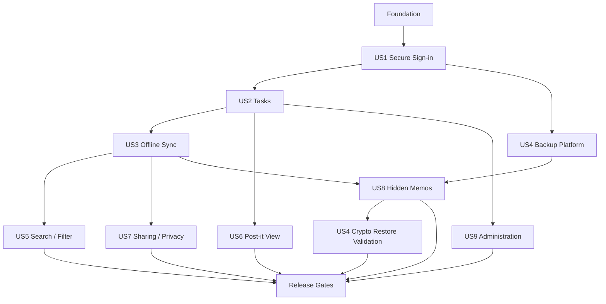
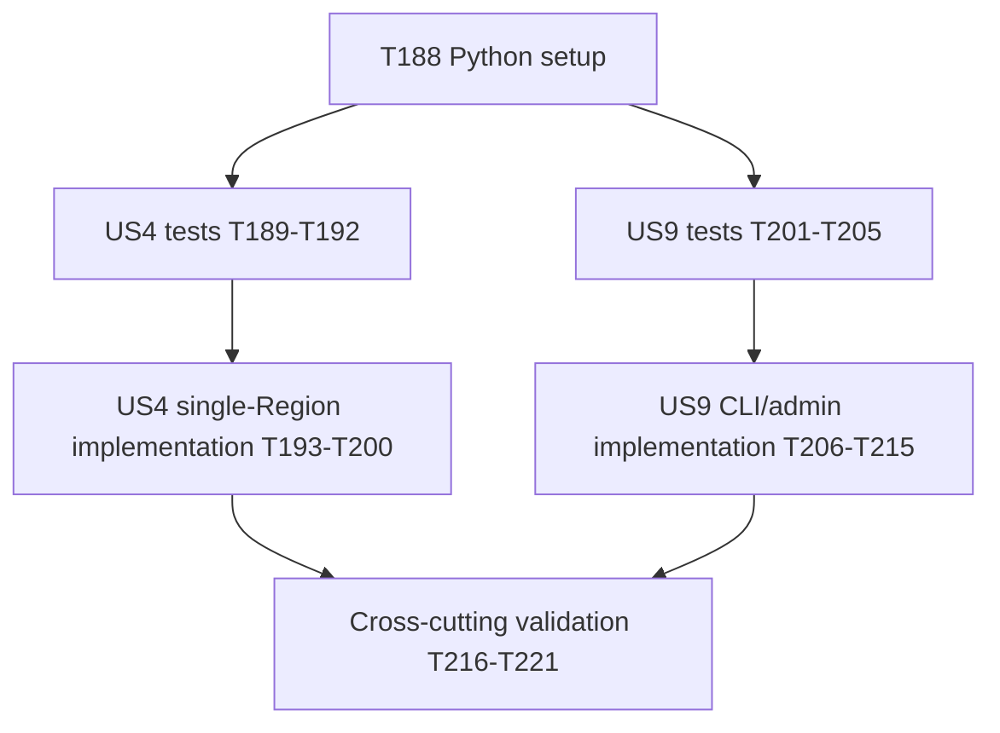

# Tasks: Na'aseh v1 Baseline

**Input**: Design documents from `/specs/001-naaseh-v1-baseline/`

**Prerequisites**: `plan.md`, `spec.md`, `research.md`, `data-model.md`, `contracts/`, `quickstart.md`

**Tests**: Automated tests are required by the constitution. Each user-story phase begins
with the applicable unit, property, integration, contract, security, and browser tests.

**Organization**: Tasks are grouped by user story and ordered so every phase produces an
independently testable increment. Exact paths follow the structure selected in `plan.md`.

## Format: `[ID] [P?] [Story?] Description`

- **[P]**: Can run in parallel after the prior phase because it changes different files.
- **[US#]**: Maps the task to the matching user story in `spec.md`.
- Every implementation task names the exact file or directory it creates or updates.

## Phase 1: Setup

**Purpose**: Establish the TypeScript monorepo, pinned toolchain, validation commands, and
empty application/infrastructure packages.

- [x] T001 Create the npm workspace manifest and standard build/test scripts in package.json
- [x] T002 Create shared strict TypeScript compiler settings in tsconfig.base.json
- [x] T003 [P] Initialize the React/Vite web package manifest and entry files in apps/web/package.json and apps/web/src/main.tsx
- [x] T004 [P] Initialize the Node.js Lambda API package manifest and entry module in apps/api/package.json and apps/api/src/index.ts
- [x] T005 [P] Initialize shared contracts, domain, observability, and fixture package manifests in packages/contracts/package.json, packages/domain/package.json, packages/observability/package.json, and packages/test-fixtures/package.json
- [x] T006 [P] Initialize the AWS CDK v2 TypeScript application in infra/package.json, infra/bin/naaseh.ts, and infra/cdk.json
- [x] T007 Configure ESLint, Prettier, and repository ignore rules in eslint.config.js, .prettierrc.json, .prettierignore, and .gitignore
- [x] T008 Configure Vitest workspaces and coverage thresholds in vitest.workspace.ts and vitest.config.ts
- [x] T009 Configure Playwright Chromium, WebKit, iPhone, and iPad projects in playwright.config.ts
- [x] T010 Configure runtime environment parsing and safe defaults, including literal-only VERBOSE_LOGGING, in packages/domain/src/config/environment.ts
- [x] T011 Copy and validate the logo asset for PWA use in apps/web/public/naaseh_logo.png and apps/web/src/styles/logo-palette.ts
- [x] T012 Document local prerequisites and workspace commands in README.md

**Checkpoint**: All packages install, typecheck, and execute empty unit/browser/CDK test commands.

---

## Phase 2: Foundational (Blocking Prerequisites)

**Purpose**: Create shared contracts, data access, observability, web shell, and AWS baseline
required before any user story can be implemented.

**⚠️ CRITICAL**: No user-story implementation begins until this phase passes.

- [x] T013 Generate and export Zod request/response schemas from the OpenAPI contract in packages/contracts/src/openapi.ts and packages/contracts/src/index.ts
- [x] T014 [P] Define shared ULID, timestamp, version, actor, and problem-detail primitives in packages/domain/src/primitives.ts and packages/domain/src/problem.ts
- [x] T015 [P] Define structured redaction allowlists and VERBOSE_LOGGING behavior in packages/observability/src/logger.ts and packages/observability/src/redaction.ts
- [x] T016 [P] Add unit tests proving verbose-mode defaults and permanent secret redaction in packages/observability/test/logger.test.ts
- [x] T017 Implement API correlation IDs, safe error mapping, Origin validation, and CSRF middleware foundations in apps/api/src/shared/http.ts and apps/api/src/shared/security.ts
- [x] T018 Implement DynamoDB key builders, conditional helpers, transaction wrappers, and client setup in apps/api/src/shared/dynamodb.ts and apps/api/src/shared/keys.ts
- [x] T019 [P] Implement cryptographic random, digest, canonical-AAD, and constant-time comparison helpers in packages/domain/src/crypto/primitives.ts
- [x] T020 [P] Define the IndexedDB schema, migration framework, and encrypted-record envelope in apps/web/src/db/schema.ts and apps/web/src/db/encrypted-record.ts
- [x] T021 [P] Create the React application shell, router, error boundary, and authenticated/public layouts in apps/web/src/app/App.tsx, apps/web/src/app/router.tsx, and apps/web/src/app/ErrorBoundary.tsx
- [x] T022 [P] Create logo-derived navy/green design tokens, responsive breakpoints, safe-area rules, and reduced-motion defaults in apps/web/src/styles/tokens.css and apps/web/src/styles/global.css
- [x] T023 [P] Configure the PWA manifest, versioned app-shell precache, offline fallback, and update prompt in apps/web/vite.config.ts, apps/web/public/manifest.webmanifest, and apps/web/src/app/UpdatePrompt.tsx
- [x] T024 Create CDK configuration and environment validation for primary, DR, and recovery accounts in infra/lib/config.ts and infra/lib/environments.ts
- [x] T025 Implement the private S3 web origin, CloudFront distribution, Origin Access Control, HTTPS policy, Route 53 aliases, and `us-east-1` CloudFront WAF/certificate edge stack in infra/lib/naaseh-stack.ts, infra/lib/web-stack.ts, and infra/lib/edge-stack.ts
- [x] T026 Implement the API Gateway HTTP API, shared Lambda defaults, structured CloudWatch access logs, and same-origin CloudFront behavior in the consolidated infra/lib/naaseh-stack.ts with focused helpers in infra/lib/api-stack.ts
- [x] T027 Implement the on-demand DynamoDB application table with deletion protection, streams, PITR, TTL, and initial GSIs in the consolidated infra/lib/naaseh-stack.ts with focused helpers in infra/lib/data-stack.ts
- [x] T028 Implement shared CloudWatch log groups, retention policies, metrics, alarms, and dashboards in the consolidated infra/lib/naaseh-stack.ts with focused helpers in infra/lib/observability-stack.ts
- [x] T029 Configure GitHub Actions OIDC validation and staging deployment workflows in .github/workflows/validate.yml and .github/workflows/deploy-staging.yml
- [x] T030 Add foundational CDK snapshot/security tests and OpenAPI validation tests in infra/test/foundation.test.ts and tests/contract/openapi.test.ts

**Checkpoint**: A staging shell deploys through OIDC, serves only through CloudFront, exposes
an empty same-origin API, logs safely, and passes CDK/OpenAPI/browser smoke tests.

---

## Phase 3: User Story 1 — Sign In Securely (Priority: P1) 🎯

**Goal**: Provision a user through an authorized backend path and authenticate through the
minimal logo/username/password screen with revocable server-side sessions.

**Independent Test**: Provision a user, test valid/wrong/unknown credentials, inspect stored
verifiers and logs, revoke the session, and verify only authenticated access reaches task APIs.

### Tests for User Story 1

- [x] T031 [P] [US1] Add Argon2id parameter, dummy-verifier, pepper-version, and timing unit tests in apps/api/test/auth/password.test.ts
- [x] T032 [P] [US1] Add opaque-session expiry, rotation, revocation, cookie, Origin, and CSRF tests in apps/api/test/auth/session.test.ts
- [x] T033 [P] [US1] Add login/session/logout and backend provisioning contract tests in tests/contract/auth.contract.test.ts
- [x] T034 [P] [US1] Add Chromium/WebKit responsive login and generic-failure Playwright tests in tests/e2e/auth.spec.ts
- [x] T035 [P] [US1] Add authentication abuse, enumeration, redaction, and rate-limit security tests in tests/security/auth.security.test.ts

### Implementation for User Story 1

- [x] T036 [US1] Define User and Session entities, validation, and key mappings in packages/domain/src/user.ts and packages/domain/src/session.ts
- [x] T037 [US1] Implement canonical username claims and user/session repositories in apps/api/src/auth/user-repository.ts and apps/api/src/auth/session-repository.ts
- [x] T038 [US1] Implement Argon2id PHC hashing, Secrets Manager pepper retrieval, dummy verification, and deployed calibration hooks in apps/api/src/auth/password.ts
- [x] T039 [US1] Implement secure opaque cookie issuance, CSRF tokens, idle/absolute expiry, session epoch, and revocation in apps/api/src/auth/session-service.ts
- [x] T040 [US1] Implement login, session, and logout handlers from openapi.yaml in apps/api/src/auth/handlers.ts
- [x] T041 [US1] Implement administrator-only backend user provisioning with write-only password/PIN inputs in apps/api/src/admin/provision-user.ts and tools/provision-user.ts
- [x] T042 [US1] Implement DynamoDB account/IP failure counters, exponential delay, and WAF/API throttling configuration in apps/api/src/auth/rate-limit.ts and infra/lib/auth-security.ts
- [x] T043 [US1] Create isolated auth Lambda sizing, reserved concurrency, Secrets Manager pepper, and route integrations in infra/lib/auth-stack.ts
- [x] T044 [US1] Build the logo-only username/password login screen and session bootstrap flow in apps/web/src/features/auth/LoginPage.tsx and apps/web/src/features/auth/session.ts
- [ ] T045 [US1] Add the deployed Argon2id cold/warm p95 calibration command and CloudWatch alarm evidence in tests/performance/argon2-lambda.test.ts and docs/operations/argon2-calibration.md

**Checkpoint**: User Story 1 passes independently with Argon2id at ≥100 MiB, `p=1`, ≤1 second
p95 verification, generic failures, safe logs, and immediate session revocation.

---

## Phase 4: User Story 2 — Manage Tasks and Subtasks (Priority: P1)

**Goal**: Create, edit, complete, reopen, archive, and inspect tasks/subtasks with durable
immutable revisions in the regular responsive list view.

**Independent Test**: Create a fully populated task and subtask, update/complete/reopen both,
verify category/assignee defaults, and prove one immutable logical revision per mutation replay.

### Tests for User Story 2

- [x] T046 [P] [US2] Add Task, Category, Reminder, and TaskRevision validation/state-transition tests in packages/domain/test/task.test.ts and packages/domain/test/category.test.ts
- [x] T047 [P] [US2] Add cycle detection, semantic completion, idempotency, and transaction property tests in apps/api/test/tasks/task-service.test.ts
- [x] T048 [P] [US2] Add task CRUD/completion/revision OpenAPI contract tests in tests/contract/tasks.contract.test.ts
- [x] T049 [P] [US2] Add DynamoDB current-task plus immutable-revision integration tests in tests/integration/task-repository.test.ts
- [x] T050 [P] [US2] Add responsive list, form, subtask, completion, revision, and local due-reminder Playwright tests in tests/e2e/tasks-list.spec.ts

### Implementation for User Story 2

- [x] T051 [US2] Define Task, TaskRevision, Category, and Reminder domain schemas and operations in packages/domain/src/task.ts, packages/domain/src/revision.ts, packages/domain/src/category.ts, and packages/domain/src/reminder.ts
- [x] T052 [US2] Implement safe URL validation, task/subtask cycle detection, category defaults, and semantic completion rules in apps/api/src/tasks/task-policy.ts
- [x] T053 [US2] Implement atomic task current-state, revision, idempotency, and feed-change transactions in apps/api/src/tasks/task-repository.ts
- [x] T054 [US2] Implement task create/get/patch/completion/revision handlers in apps/api/src/tasks/handlers.ts
- [x] T055 [US2] Implement safe task/revision structured logging and metrics in apps/api/src/tasks/telemetry.ts
- [x] T056 [US2] Implement encrypted local Task, Category, Revision, and Reminder repositories in apps/web/src/db/task-repository.ts and apps/web/src/db/reminder-repository.ts
- [x] T057 [US2] Build the regular task list, responsive rows, empty/loading/error states, and task-detail route in apps/web/src/features/tasks/TaskListPage.tsx and apps/web/src/features/tasks/TaskRow.tsx
- [x] T058 [US2] Build create/edit forms with label, HTTPS link, memo, due zone/time, assignee, category, group, privacy, and category-default behavior in apps/web/src/features/tasks/TaskForm.tsx
- [x] T059 [US2] Build nested subtask display/editing with cycle-safe actions in apps/web/src/features/tasks/SubtaskTree.tsx
- [x] T060 [US2] Build completion/reopen/archive actions and revision-log viewer in apps/web/src/features/tasks/TaskActions.tsx and apps/web/src/features/tasks/RevisionLog.tsx
- [x] T061 [US2] Implement active-page offline due timers and overdue-on-open fallback in apps/web/src/notifications/local-reminders.ts and apps/web/src/features/reminders/ReminderStatus.tsx

**Checkpoint**: User Story 2 independently delivers the core regular task manager, durable
revisions, subtasks, category defaults, and active-page offline reminders.

---

## Phase 5: User Story 3 — Work Offline and Synchronize (Priority: P1)

**Goal**: Make browser task operations durable offline and synchronize them without silent loss.

**Independent Test**: Create/edit/complete offline, reload, make concurrent online edits,
reconnect twice, and verify idempotent application or explicit conflict resolution.

### Tests for User Story 3

- [x] T062 [P] [US3] Add atomic local entity/outbox, migration, quota, and cursor transaction tests in apps/web/test/db/outbox.test.ts
- [x] T063 [P] [US3] Add vector-cursor, feed-sequence, idempotency, and merge-rule property tests in apps/api/test/sync/sync-service.test.ts
- [x] T064 [P] [US3] Add bootstrap/push/pull contract and schema-version tests in tests/contract/sync.contract.test.ts
- [x] T065 [P] [US3] Add interrupted drain, duplicate replay, partial batch, and 409 integration tests in tests/integration/sync-roundtrip.test.ts
- [x] T066 [P] [US3] Add Chromium/WebKit offline reload, reconnect, conflict, and app-update Playwright tests in tests/e2e/offline-sync.spec.ts
- [x] T067 [P] [US3] Add private-cache purge and no-silent-loss security invariants in tests/security/offline-cache.security.test.ts

### Implementation for User Story 3

- [x] T068 [US3] Define SyncMutation, SyncChange, vector cursor, conflict, and idempotency schemas in packages/domain/src/sync.ts
- [x] T069 [US3] Implement per-audience feed counters, public/owner shards, cursor queries, and tombstones in apps/api/src/sync/change-feed-repository.ts
- [x] T070 [US3] Implement base-version conflict detection, non-overlapping safe merges, and stable replay results in apps/api/src/sync/sync-service.ts
- [x] T071 [US3] Implement authorized bootstrap, push, and pull handlers with batch/size limits in apps/api/src/sync/handlers.ts
- [x] T072 [US3] Create the sync Lambda routes, DynamoDB permissions, throttles, and alarms in infra/lib/sync-stack.ts
- [x] T073 [US3] Implement atomic Dexie entity/outbox writes, durable cursor vectors, and conflict records in apps/web/src/db/outbox.ts and apps/web/src/db/sync-cursor.ts
- [x] T074 [US3] Implement sequential-per-entity outbox drain, retry/jitter, pull commits, and foreground triggers in apps/web/src/sync/sync-engine.ts
- [x] T075 [US3] Implement explicit same-field/delete conflicts and resolution mutations in apps/web/src/sync/conflict-resolution.ts and apps/web/src/features/sync/ConflictDialog.tsx
- [x] T076 [US3] Implement pending/synced/retry/conflict connectivity indicators and manual retry in apps/web/src/features/sync/SyncStatus.tsx
- [x] T077 [US3] Implement storage persistence/quota monitoring and safe blocked-save behavior in apps/web/src/db/storage-health.ts and apps/web/src/features/sync/StorageWarning.tsx
- [x] T078 [US3] Implement service-worker update coordination that preserves open edits/outbox records in apps/web/src/app/service-worker-update.ts

**Checkpoint**: User Story 3 passes cold offline reload, replay, conflict, schema upgrade, and
storage-failure tests without losing acknowledged local work.

---

## Phase 6: User Story 4 — Back Up and Recover All Data (Priority: P1)

**Goal**: Meet five-minute RPO/four-hour RTO and prove data plus cryptographic dependencies restore.

**Independent Test**: Remove active data/key access, restore into isolation, verify counts,
hashes, authorization, and representative memo recovery across every retained key generation.

### Tests for User Story 4

- [x] T079 [P] [US4] Add BackupManifest, key-inventory, signature, and integrity unit tests in packages/domain/test/backup-manifest.test.ts
- [x] T080 [P] [US4] Add recovery-wrap completeness and missing-key failure fixtures in packages/test-fixtures/src/recovery-packages.ts and tests/security/recovery-package.security.test.ts
- [x] T081 [P] [US4] Add CDK tests for global replicas, PITR, deletion protection, backup vault copies, Vault Lock, and KMS deletion denies in infra/test/recovery-stack.test.ts
- [x] T082 [P] [US4] Add Step Functions restore-state and failure-path integration tests in tests/restore/restore-workflow.test.ts
- [x] T083 [P] [US4] Add RPO/RTO, authorization, and multi-key-generation restore validation in tests/restore/full-restore.test.ts

### Implementation for User Story 4

- [x] T084 [US4] Define BackupManifest, recovery package inventory, restore evidence, and key lifecycle schemas in packages/domain/src/backup.ts
- [x] T085 [US4] Implement canonical manifest hashing and KMS signing/verification in apps/api/src/crypto-recovery/backup-manifest.ts
- [x] T086 [US4] Configure the active/passive two-Region DynamoDB global table, PITR, deletion protection, and replication alarms in infra/lib/global-data-stack.ts
- [x] T087 [US4] Configure primary multi-Region and independent recovery-account asymmetric KMS keys, policies, aliases, deletion denies, and public registries in infra/lib/recovery-key-stack.ts
- [x] T088 [US4] Configure runtime Secrets Manager secrets, DR replication, separate KMS encryption, rotation metadata, and policy alarms in infra/lib/secrets-stack.ts
- [x] T089 [US4] Configure daily AWS Backup plans, cross-Region/cross-account copies, logically air-gapped or locked vault retention, and restore testing in infra/lib/backup-stack.ts
- [x] T090 [US4] Configure profile-media versioning, replication, backup, and private access in infra/lib/media-stack.ts
- [x] T091 [US4] Implement backup-manifest generation, entity/key inventory, and evidence storage in apps/api/src/crypto-recovery/manifest-service.ts
- [x] T092 [US4] Implement the isolated Step Functions restore orchestration and validation Lambdas in infra/lib/restore-workflow-stack.ts and apps/api/src/crypto-recovery/restore-validator.ts
- [x] T093 [US4] Implement the least-privilege recovery role boundary and safe recovery audit logging in apps/api/src/crypto-recovery/authorization.ts and apps/api/src/crypto-recovery/telemetry.ts
- [x] T094 [US4] Create the quarterly restore schedule, cleanup controls, and failure notifications in infra/lib/restore-schedule-stack.ts
- [x] T095 [US4] Write the backup, key-rotation, regional failover, and isolated-restore runbooks in docs/operations/backup-recovery.md and docs/operations/key-rotation.md

**Checkpoint**: P1 baseline is complete only after an isolated restore demonstrates ≤5-minute
RPO, ≤4-hour RTO, all required key material, protected authorization, and no plaintext leakage.

---

## Phase 7: User Story 5 — Find and Focus Tasks (Priority: P2)

**Goal**: Search authorized labels/memos and combine date, range, assignee, and category filters offline.

**Independent Test**: Seed mixed visibility/hidden data, search partial terms, combine every
filter online/offline, and prove locked or unauthorized content never affects results/counts.

### Tests for User Story 5

- [x] T096 [P] [US5] Add search normalization, prefix/fuzzy ranking, filter-composition, and stale-ID unit tests in apps/web/test/search/task-search.test.ts
- [x] T097 [P] [US5] Add locked-hidden/private no-disclosure search security tests in tests/security/search-privacy.security.test.ts
- [x] T098 [P] [US5] Add Chromium/WebKit online/offline search and combined-filter Playwright tests in tests/e2e/search-filter.spec.ts

### Implementation for User Story 5

- [x] T099 [US5] Implement the derived MiniSearch label/memo index with incremental Task updates in apps/web/src/search/task-index.ts
- [x] T100 [US5] Implement in-memory-only hidden memo indexing hooks and purge-on-lock behavior in apps/web/src/search/hidden-memo-index.ts
- [x] T101 [US5] Implement date/time-zone, range, assignee, category, and status filter composition in apps/web/src/search/task-filters.ts
- [x] T102 [US5] Build responsive search input, filter controls, active chips, result counts, and empty states in apps/web/src/features/search/TaskSearchBar.tsx and apps/web/src/features/search/TaskFilters.tsx
- [x] T103 [US5] Integrate shared search/filter state into the task list and URL-safe non-sensitive navigation state in apps/web/src/features/search/search-state.ts
- [x] T104 [US5] Add search-index rebuild/version migration and performance measurement for the 50,000-task fixture in apps/web/src/search/index-migration.ts and tests/performance/local-search.test.ts

**Checkpoint**: User Story 5 returns correct authorized results within one second p95 and
persists no hidden memo tokens.

---

## Phase 8: User Story 6 — Switch Between List and Post-it Views (Priority: P2)

**Goal**: Present the current task set as accessible responsive post-it notes with category
colors and a reduced-motion-safe crumple completion treatment.

**Independent Test**: Preserve search/filters while switching views at desktop/iPhone/iPad
sizes and complete tasks with normal and reduced-motion preferences.

### Tests for User Story 6

- [x] T105 [P] [US6] Add category color contrast and foreground-selection unit tests in apps/web/test/styles/category-color.test.ts
- [x] T106 [P] [US6] Add list/post-it shared-state and completion-animation component tests in apps/web/test/features/post-it-view.test.tsx
- [x] T107 [P] [US6] Add desktop/iPhone/iPad portrait/landscape/split-view and reduced-motion Playwright tests in tests/e2e/post-it-view.spec.ts
- [x] T108 [P] [US6] Add keyboard, focus, status announcement, and axe accessibility tests in tests/e2e/post-it-accessibility.spec.ts

### Implementation for User Story 6

- [x] T109 [US6] Implement accessible foreground calculation and category color fallback in apps/web/src/styles/category-color.ts
- [x] T110 [US6] Build the responsive post-it grid and note component using the shared task query in apps/web/src/features/postit/PostItView.tsx and apps/web/src/features/postit/PostItNote.tsx
- [x] T111 [US6] Implement CSS crumple keyframes, completion status announcement, and reduced-motion alternative in apps/web/src/features/postit/post-it-animation.css
- [x] T112 [US6] Implement persistent per-user list/post-it preference and view switcher in apps/web/src/features/tasks/ViewSwitcher.tsx and apps/web/src/db/preferences-repository.ts
- [x] T113 [US6] Preserve search, filters, focus destination, and scroll context across view changes in apps/web/src/features/tasks/task-view-state.ts
- [x] T114 [US6] Integrate idempotent completion/outbox behavior with the post-it animation lifecycle in apps/web/src/features/postit/usePostItCompletion.ts

**Checkpoint**: User Story 6 is independently usable and accessible on all supported viewports.

---

## Phase 9: User Story 7 — Share Work and Protect Private Tasks (Priority: P2)

**Goal**: Create/join groups while keeping every non-private task globally visible and every
private task strictly owner-only in API, sync, cache, search, revisions, counts, and logs.

**Independent Test**: Use three accounts, group PINs, membership changes, public/private
transitions, and offline clients to validate all visibility boundaries.

### Tests for User Story 7

- [x] T115 [P] [US7] Add Group, Membership, PIN-verifier, and privacy-transition domain tests in packages/domain/test/group.test.ts and packages/domain/test/task-privacy.test.ts
- [x] T116 [P] [US7] Add group create/join and public/private task contract tests in tests/contract/groups-privacy.contract.test.ts
- [x] T117 [P] [US7] Add public/owner GSI, paired tombstone/upsert, and private revision integration tests in tests/integration/privacy-access.test.ts
- [x] T118 [P] [US7] Add cross-user direct-object-reference, search/count/log/cache disclosure security tests in tests/security/private-tasks.security.test.ts
- [x] T119 [P] [US7] Add group PIN rate-limit and offline visibility-transition Playwright tests in tests/e2e/groups-private-tasks.spec.ts

### Implementation for User Story 7

- [x] T120 [US7] Define Group, GroupMembership, join PIN verifier, role, and lifecycle schemas in packages/domain/src/group.ts
- [x] T121 [US7] Implement group/membership adjacency records and conditional membership operations in apps/api/src/groups/group-repository.ts
- [x] T122 [US7] Implement group creation, Argon2id join-PIN verification, join, revoke, and management policies in apps/api/src/groups/group-service.ts
- [x] T123 [US7] Implement group endpoints and safe audit events from openapi.yaml in apps/api/src/groups/handlers.ts
- [x] T124 [US7] Enforce public-versus-owner DynamoDB query paths and conceal private direct access/revisions in apps/api/src/tasks/task-authorization.ts
- [x] T125 [US7] Implement atomic public-to-private and private-to-public paired feed changes in apps/api/src/tasks/privacy-transition.ts
- [x] T126 [US7] Build group creation, join PIN, membership, and status interfaces in apps/web/src/features/groups/GroupPage.tsx and apps/web/src/features/groups/JoinGroupDialog.tsx
- [x] T127 [US7] Build task privacy controls with clear owner-only consequences in apps/web/src/features/tasks/PrivacyControl.tsx
- [x] T128 [US7] Implement local private-task purge/tombstone handling across data and derived indexes in apps/web/src/sync/privacy-purge.ts
- [x] T129 [US7] Configure group/admin routes, least-privilege Lambda access, join throttles, and alarms in infra/lib/collaboration-stack.ts
- [x] T130 [US7] Document the all-user public visibility model, private boundary, and cached-revocation limitation in docs/security/authorization-model.md

**Checkpoint**: User Story 7 passes all multi-user online/offline authorization tests with zero disclosures.

---

## Phase 10: User Story 8 — Protect Sensitive Memos with a PIN (Priority: P2)

**Goal**: Encrypt hidden memos in the browser, unlock them by PIN offline, keep search terms
in memory only, and recover/rewrap keys without exposing plaintext to routine operators.

**Independent Test**: Encrypt, sync, reload offline, unlock/search/relock, tamper with AAD,
copy browser storage, rotate PIN/recovery keys, and exercise the owner recovery flow.

### Tests for User Story 8

- [x] T131 [P] [US8] Add AES-GCM/AAD, PIN Argon2id, wrap/version, tamper, and zeroization unit tests in apps/web/test/crypto/hidden-memo.test.ts
- [x] T132 [P] [US8] Add cryptography package schema and required dual-recovery-wrap contract tests in tests/contract/hidden-memo.contract.test.ts
- [x] T133 [P] [US8] Add wrong-PIN, copied-storage, locked-search, verbose-log, and XSS-boundary security tests in tests/security/hidden-memo.security.test.ts
- [x] T134 [P] [US8] Add KMS recovery authorization, ephemeral re-encryption, and rotation integration tests in tests/integration/hidden-memo-recovery.test.ts
- [x] T135 [P] [US8] Add Chromium/WebKit online/offline unlock, inactivity lock, PIN change, and recovery Playwright tests in tests/e2e/hidden-memo.spec.ts

### Implementation for User Story 8

- [x] T136 [US8] Define and validate HiddenMemoPackage v1, AAD, PIN wrap, and recovery wrap schemas in packages/domain/src/crypto/hidden-memo-package.ts
- [x] T137 [US8] Implement pinned Argon2id WebAssembly PIN derivation in a worker with calibrated mobile parameters in apps/web/src/crypto/pin-kdf.worker.ts
- [x] T138 [US8] Implement browser AES-256-GCM memo encryption/decryption and per-memo random DEKs in apps/web/src/crypto/hidden-memo.ts
- [x] T139 [US8] Implement PIN-derived DEK wrap/unwrap, inactivity/tab-hide lock, and memory-only plaintext lifecycle in apps/web/src/crypto/pin-wrap.ts and apps/web/src/crypto/unlock-session.ts
- [x] T140 [US8] Implement signed KMS public-key registry validation and primary/recovery-account DEK wrapping in apps/web/src/crypto/recovery-wrap.ts
- [x] T141 [US8] Implement server validation that all active recovery wraps exist before acknowledging sync in apps/api/src/crypto-recovery/package-validator.ts
- [x] T142 [US8] Implement owner password re-verification, ephemeral browser-key exchange, KMS decrypt/rewrap, and audit flow in apps/api/src/crypto-recovery/pin-recovery.ts
- [x] T143 [US8] Create the isolated recovery Lambda routes, KMS permissions, concurrency limits, and alarms in infra/lib/crypto-recovery-stack.ts
- [x] T144 [US8] Build hidden-memo edit, locked display, PIN prompt, recovery, and risk disclosure interfaces in apps/web/src/features/memos/HiddenMemoEditor.tsx and apps/web/src/features/memos/UnlockMemoDialog.tsx
- [x] T145 [US8] Integrate unlocked hidden terms with memory-only search and purge events in apps/web/src/features/memos/useHiddenMemoSearch.ts
- [x] T146 [US8] Implement PIN change and key-version migration without memo re-encryption in apps/web/src/features/memos/ChangePinFlow.tsx
- [x] T147 [US8] Document the offline PIN brute-force risk, AWS recovery trust boundary, rotation, and incident response in docs/security/hidden-memo-threat-model.md

**Checkpoint**: User Story 8 works offline, persists no plaintext/search tokens, requires all
recovery wraps, and restores through the audited owner-mediated flow.

---

## Phase 11: User Story 9 — Administer Users and Categories (Priority: P3)

**Goal**: Give administrators centralized user/category management with profile pictures,
safe disablement, defaults, colors, and preserved historical attribution.

**Independent Test**: Provision/disable a user, upload a picture, create/update/archive a
category, and verify login revocation, default assignment, color, and historical references.

### Tests for User Story 9

- [x] T148 [P] [US9] Add username/category uniqueness, disablement, archived-reference, and default-assignee tests in apps/api/test/admin/admin-service.test.ts
- [x] T149 [P] [US9] Add admin user/category/profile upload contract tests in tests/contract/admin.contract.test.ts
- [x] T150 [P] [US9] Add admin authorization, picture-object access, secret redaction, and session-revocation security tests in tests/security/admin.security.test.ts
- [x] T151 [P] [US9] Add responsive user/category administration Playwright tests in tests/e2e/admin.spec.ts

### Implementation for User Story 9

- [x] T152 [US9] Implement category uniqueness, create/update/archive, and default-assignee repository operations in apps/api/src/categories/category-repository.ts
- [x] T153 [US9] Implement category administration handlers and safe revision events in apps/api/src/categories/handlers.ts
- [x] T154 [US9] Implement user list, disable/reactivate, session-epoch revocation, and historical attribution services in apps/api/src/admin/user-admin-service.ts
- [x] T155 [US9] Implement private profile-picture upload tokens, validation, transforms, and signed reads in apps/api/src/admin/profile-picture.ts
- [x] T156 [US9] Build centralized user and category administration pages in apps/web/src/features/admin/UsersAdminPage.tsx and apps/web/src/features/admin/CategoriesAdminPage.tsx
- [x] T157 [US9] Build accessible category color/default-assignee editing and archived-state handling in apps/web/src/features/admin/CategoryForm.tsx
- [x] T158 [US9] Configure admin/category/media routes, private S3 permissions, image processing Lambda, and alarms in infra/lib/admin-stack.ts

**Checkpoint**: User Story 9 passes admin authorization, revocation, category consistency,
profile privacy, and historical-reference tests.

---

## Phase 12: Polish & Cross-Cutting Quality Gates

**Purpose**: Complete release-level validation, documentation, cost review, and final re-review.

- [x] T159 [P] Update architecture, local setup, deployment, offline behavior, and recovery documentation in README.md and docs/architecture/overview.md
- [x] T160 [P] Add Web Push subscriptions, EventBridge Scheduler lifecycle, generic payloads, and overdue fallback in apps/api/src/notifications/web-push.ts, infra/lib/notification-stack.ts, and apps/web/src/notifications/push.ts
- [x] T161 [P] Add Web Push/closed-app/overdue Chromium and WebKit integration tests in tests/integration/web-push.test.ts and tests/e2e/reminders.spec.ts
- [x] T162 Run the complete quickstart validation and record results in specs/001-naaseh-v1-baseline/validation-results.md
- [ ] T163 Run the real macOS Safari, iPhone, and iPad ordinary-tab/Home-Screen release matrix and record evidence in docs/testing/safari-release-matrix.md
- [x] T164 Run WCAG 2.2 AA keyboard, contrast, status, focus, touch-target, and reduced-motion review and record findings in docs/testing/accessibility-report.md
- [x] T165 Run authentication, authorization, CSRF, XSS/CSP, dependency, offline cache, cryptography, recovery, and log-redaction security review in docs/security/release-review.md
- [x] T166 Add strict Content Security Policy, security headers, dependency pinning, and third-party-script restrictions in infra/lib/web-security.ts and apps/web/index.html
- [ ] T167 Run task UI, sync, search, Argon2, API, global-table lag, and restore performance tests and record p50/p95 results in docs/testing/performance-report.md
- [ ] T168 Validate CloudWatch log detail, literal-only verbose behavior, redaction, retention, metrics, alarms, and expected monthly cost in docs/operations/observability-review.md
- [x] T169 Review AWS services, replicated resources, serverless alternatives, cost drivers, budgets, and removal candidates in docs/operations/aws-cost-review.md
- [ ] T170 Configure production GitHub environment protection, required checks, least-privilege OIDC trust, deployment rollback, and smoke gates in .github/workflows/deploy-production.yml
- [x] T171 Add production canary/smoke tests for login, authorized sync, safe error handling, and static delivery in tests/e2e/production-smoke.spec.ts
- [ ] T172 Execute a quarterly-style isolated restore using current data/key generations and attach evidence in docs/operations/restore-test-report.md
- [x] T173 Re-run all unit, property, integration, contract, security, performance, Chromium, and WebKit suites and record the release command output in specs/001-naaseh-v1-baseline/validation-results.md
- [x] T174 Re-review the final diff for correctness, unnecessary complexity, data loss, authorization, crypto, logging, comments, platform support, and documentation in docs/reviews/final-diff-review.md
- [ ] T175 Verify every implementation task and constitution gate is complete and update specs/001-naaseh-v1-baseline/tasks.md and specs/001-naaseh-v1-baseline/plan.md with final status

---

## Dependencies & Execution Order

### Phase Dependencies

- **Setup (Phase 1)**: Starts immediately.
- **Foundational (Phase 2)**: Depends on Setup and blocks every user story.
- **US1 (Phase 3)**: Starts after Foundational; authentication is required by all later stories.
- **US2 (Phase 4)**: Depends on US1 and establishes the task/revision core.
- **US3 (Phase 5)**: Depends on US1 and US2 because it synchronizes authorized tasks.
- **US4 (Phase 6)**: Recovery infrastructure can begin after Foundational, but full acceptance
  requires US1 data, US2 revisions, and the US8 hidden-memo package/recovery flow.
- **US5 (Phase 7)**: Depends on US2 local task data and US3 offline persistence.
- **US6 (Phase 8)**: Depends on US2 task/completion state; can run parallel with US5.
- **US7 (Phase 9)**: Depends on US1 authorization, US2 tasks, and US3 visibility tombstones.
- **US8 (Phase 10)**: Depends on US1 re-verification, US2 tasks, US3 offline storage, and US4 KMS recovery foundations.
- **US9 (Phase 11)**: Depends on US1 roles/revocation and US2 category references; can overlap US5–US8 after those dependencies.
- **Polish (Phase 12)**: Depends on all selected user stories.

### User Story Dependency Graph



### Within Each User Story

1. Write the listed tests first and confirm they fail for the intended missing behavior.
2. Implement domain models and policies before repositories.
3. Implement repositories before services/handlers.
4. Implement interfaces after contracts and server behavior exist.
5. Run the independent checkpoint before starting dependent work.

## Parallel Opportunities

- Setup package scaffolds T003–T006 can run together after T001–T002.
- Foundation domain, logging, browser DB, UI shell, and CSS tasks T014–T023 can be split by file boundary.
- Each story's `[P]` test tasks can be authored together before story implementation.
- US4 infrastructure work can proceed alongside US2/US3, then perform final crypto restore validation after US8.
- US5 search and US6 post-it UI can run in parallel after US2/US3 prerequisites.
- US9 administration can overlap US5–US8 after US1/US2 are stable.
- Final documentation, reminder integration, accessibility, security, performance, observability, and cost reviews can be prepared in parallel before the final release rerun.

## Parallel Examples

```text
US1: T031 password tests | T032 session tests | T033 contract tests | T034 browser tests | T035 security tests
US2: T046 domain tests | T047 service properties | T048 contract tests | T049 repository integration | T050 browser tests
US3: T062 local DB tests | T063 sync properties | T064 contract tests | T065 roundtrip integration | T066 browser tests | T067 security tests
US4: T079 manifest tests | T080 recovery fixtures | T081 CDK tests | T082 workflow tests | T083 restore acceptance
US5: T096 search tests | T097 disclosure tests | T098 browser tests
US6: T105 color tests | T106 component tests | T107 viewport tests | T108 accessibility tests
US7: T115 domain tests | T116 contract tests | T117 data access tests | T118 security tests | T119 browser tests
US8: T131 crypto tests | T132 contract tests | T133 security tests | T134 recovery integration | T135 browser tests
US9: T148 admin service tests | T149 contract tests | T150 security tests | T151 browser tests
```

## Implementation Strategy

### Safe MVP

The minimum production-safe scope is **US1–US4**: secure sign-in, durable tasks/revisions,
offline synchronization, and proven backup/recovery. US1 alone is only an authentication
slice and is useful for demonstration but is not a viable task-management release.

### Incremental Delivery

1. Complete Setup + Foundation and deploy the empty staging shell.
2. Deliver US1 and validate secure provisioning/sign-in.
3. Deliver US2 and validate the regular task manager.
4. Deliver US3 and validate offline durability/conflicts.
5. Complete US4 recovery evidence before calling the P1 baseline production-safe.
6. Add US5/US6 for retrieval and post-it experience.
7. Add US7/US8 for collaboration and protected memo workflows.
8. Add US9 central administration and complete all release gates.

## Notes

- Commit after each task or coherent dependency group.
- Mark a task `[X]` only after its stated validation passes.
- Never log passwords, PINs, raw sessions/CSRF tokens, memo plaintext, search tokens, DEKs,
  peppers, Web Push private keys, or private task values—even in verbose mode.
- Playwright WebKit does not replace the real Safari/iPhone/iPad release matrix.
- Browser reminders cannot be guaranteed while both offline and fully closed/suspended;
  preserve the documented local-open, connected-Web-Push, and overdue-on-open behavior.

## Phase 13: Convergence

- [x] T176 CRITICAL add DynamoDB transaction-level tests proving task, revision, stable mutation result, conditional feed-counter advances, public/owner feed changes, and privacy tombstones commit or roll back together under contention and replay per Constitution II/III and SC-003/SC-004
- [x] T177 Standardize the versioned API base path across OpenAPI, sync protocol, CloudFront/API Gateway routes, browser clients, smoke tests, and operational documentation per plan: same-origin API and contracts/openapi.yaml server definition
- [x] T178 Implement safe active-group discovery and explicit self-join acceptance across OpenAPI, Zod contracts, DynamoDB indexes, group handlers, the consolidated CDK routes, and integrated group UI per FR-014 and US7/AC5
- [x] T179 Add `groupId`, `dueTimeZone`, and complete safe revision metadata including before/after values, source client, and synchronization outcome across domain schemas, OpenAPI, persistence, local migration, forms, and revision UI per FR-005 and FR-007 (partial)
- [x] T180 Standardize entity identifiers on the planned ULID representation or document and execute an approved UUID migration across domain schemas, DynamoDB keys, contracts, fixtures, and clients per plan: data model and T014 (contradicts)
- [x] T181 Implement idempotent group join, revoked-membership reactivation policy, canonical owner/manager/member roles, ownership-transfer restrictions, and associated negative tests per FR-014/FR-015 and the GroupMembership data model
- [x] T182 Align group create/discover/join/revoke HTTP statuses, schemas, write-only PIN fields, responses, and contract/security tests between OpenAPI and handlers per FR-014/FR-015
- [x] T183 Standardize Node.js 24 across local prerequisites, package engine declarations, GitHub Actions, Lambda builds, and deployment validation per plan: Language/Version and quickstart prerequisites (partial)
- [x] T184 Deliver CSP and framing protection through CloudFront/API response headers, remove ineffective meta-only `frame-ancestors`, and add header-level security tests per Constitution I and NFR-001 (partial)
- [x] T185 Add shared safe error classification and mapping for validation, authorization, conditional conflicts, throttling, retryable AWS failures, and partial external-service failures with correlated CloudWatch events and failure-path tests per FR-021 and SC-010
- [x] T186 Choose the custom observability package or AWS Powertools as the single supported logging approach, then align dependencies, the plan, Lambda instrumentation, redaction, metrics, and documentation per plan: Primary Dependencies and Constitution II (partial)
- [x] T187 Extract focused web, API, data, observability, and recovery helper constructs/policies consumed by the single deployable `NaasehStack`, with CDK assertions for each concern and no additional deployed stacks per plan: consolidated-stack decision (partial)

---

## Phase 14: New Requirements Setup

**Purpose**: Add the bounded Python operator toolchain without creating a second domain
implementation or disturbing the existing TypeScript workspace.

- [x] T188 [P] Add Python 3.12 operator dependencies, test command, and generated-file ignores in scripts/requirements.txt, package.json, and .gitignore

**Checkpoint**: The repository can install Boto3, discover Python unit tests, and exclude
Python caches/virtual environments while retaining the existing Node.js build.

---

## Phase 15: User Story 4 Delta — Single-Region Backup and Recovery (Priority: P1)

**Goal**: Replace the duplicate multi-Region architecture with one `us-west-2` deployment
that retains PITR, locked same-Region backups, required cryptographic recovery material, and
isolated restore testing.

**Independent Test**: Synthesize production with default configuration and verify every
Region-scoped resource is in `us-west-2`, no DynamoDB replica/cross-Region copy/replicated
secret or key/passive stack exists, PITR and the locked backup vault remain enabled, and an
isolated same-Region restore recovers all entity and retained key versions within the stated
RPO/RTO while explicitly reporting that total Region loss is outside v1 scope.

### Tests for the User Story 4 Delta

- [x] T189 [P] [US4] Replace global-table and cross-Region CDK assertions with single-table, PITR, same-Region Vault Lock, and no-replica assertions in infra/test/recovery-stack.test.ts and infra/test/foundation.test.ts
- [x] T190 [P] [US4] Add configuration tests for `NAASEH_AWS_REGION` defaulting to `us-west-2`, rejecting another production Region, and allowing no recovery Region in infra/test/single-region-config.test.ts
- [x] T191 [P] [US4] Update recovery-package and manifest security tests for one required `us-west-2` recovery wrap, retained key versions, and missing-key failure in tests/security/recovery-package.security.test.ts and apps/api/test/crypto-recovery/manifest-service.test.ts
- [x] T192 [P] [US4] Update restore integration tests for same-Region temporary resources, locked recovery points, cleanup, achieved RPO/RTO, and the Region-loss limitation in tests/restore/restore-workflow.test.ts and tests/restore/full-restore.test.ts

### Implementation for the User Story 4 Delta

- [x] T193 [US4] Replace primary/recovery Region and recovery-account configuration with validated `NAASEH_AWS_REGION=us-west-2` defaults and production rejection in infra/lib/config.ts and infra/lib/environments.ts
- [x] T194 [US4] Convert the global-table helper to create one regional on-demand DynamoDB table with streams, PITR, deletion protection, TTL, and existing GSIs in infra/lib/global-data-stack.ts and infra/lib/data-stack.ts
- [x] T195 [US4] Remove multi-Region and recovery-account key/secret/media replication while retaining single-Region KMS recovery/signing keys, secret versions, S3 versioning, deletion protection, and alarms in infra/lib/recovery-key-stack.ts, infra/lib/secrets-stack.ts, and infra/lib/media-stack.ts
- [x] T196 [US4] Replace cross-Region/cross-account backup copy actions with daily same-Region recovery points, compliance-mode Vault Lock, failure notifications, and quarterly restore testing in infra/lib/backup-stack.ts
- [x] T197 [US4] Remove recovery Region/account inputs and passive composition from the deployable stack while exporting the validated Region and restore resources in infra/lib/naaseh-stack.ts and infra/bin/naaseh.ts
- [x] T198 [US4] Require exactly the active versioned `us-west-2` KMS recovery authority without a replica/recovery-account wrap in apps/api/src/crypto-recovery/public-key-registry.ts, apps/web/src/crypto/recovery-wrap.ts, and apps/web/src/crypto/pin-recovery-client.ts
- [x] T199 [US4] Record `us-west-2`, retained KMS/Secrets versions, recovery-point identity, and restore evidence in signed backup manifests in apps/api/src/crypto-recovery/backup-manifest.ts and apps/api/src/crypto-recovery/manifest-service.ts
- [x] T200 [US4] Replace regional-failover instructions with same-Region backup/restore procedures, key-retention safeguards, recovery limitations, and revised cost drivers in docs/operations/backup-recovery.md, docs/operations/key-rotation.md, docs/operations/recovery.md, and docs/operations/aws-cost-review.md

**Checkpoint**: User Story 4 passes independently with no duplicate Regional architecture,
working same-Region backups/restores, preserved hidden-memo recovery boundaries, safe logs,
and an explicit total-Region-loss limitation.

---

## Phase 16: User Story 9 Delta — Python Provisioning and Explicit Admin Rights (Priority: P3)

**Goal**: Provide a secure Python command for bootstrapping/adding users and enforce the
least-privilege application-admin matrix for user and category management without granting
access to other users' private or hidden content.

**Independent Test**: Use an IAM principal limited to the provisioning Lambda to create a
standard user and administrator with hidden password/PIN prompts; verify safe retry and
redacted output, then verify application admins can add/list/disable/reactivate users and
create/update/archive categories while regular users receive `403`, all users retain category
read access, administrative lockout is prevented, and admin status cannot expose another
user's private tasks, revisions, groups, or hidden-memo plaintext.

### Tests for the User Story 9 Delta

- [x] T201 [P] [US9] Add Python unit tests for arguments, defaults, role selection, `us-west-2` enforcement, hidden prompt confirmation, standard-input mode, exit codes, and redacted output in scripts/tests/test_create_user.py
- [x] T202 [P] [US9] Add contract tests proving CLI and session-authenticated administration share the same provisioning request/result schema and role semantics in tests/contract/admin.contract.test.ts and tests/contract/create-user-cli.contract.test.ts
- [x] T203 [P] [US9] Add security tests proving password/PIN absence from argv, process listings, stdout/stderr, Lambda/CloudWatch logs, returned records, and denied overbroad IAM operations in tests/security/admin-cli.security.test.ts
- [x] T204 [P] [US9] Add service tests for admin-only user/category mutations, regular-user category reads, self/last-admin disablement prevention, session-epoch revocation, and immutable audit events in apps/api/test/admin/admin-service.test.ts and apps/api/test/categories/category-authorization.test.ts
- [x] T205 [P] [US9] Extend Chromium/WebKit administration tests for user creation, `user`/`admin` role selection, mutation denial, private-data isolation, responsive layouts, and explicit online-only behavior in tests/e2e/admin.spec.ts

### Implementation for the User Story 9 Delta

- [x] T206 [US9] Refactor canonicalization, input validation, Argon2id password/PIN hashing, conditional username creation, idempotency, role assignment, and redacted audit results into the shared service in apps/api/src/admin/provision-user.ts
- [x] T207 [US9] Implement the IAM-invoked schema-versioned provisioning Lambda handler with safe operator-principal/correlation logging and stable conflict/error mapping in apps/api/src/admin/provision-user-handler.ts
- [x] T208 [US9] Add session-authenticated `POST /admin/users`, prevent self/last-active-admin disablement, and return only allowlisted administrative views in apps/api/src/admin/handler.ts and apps/api/src/admin/user-admin-service.ts
- [x] T209 [US9] Centralize the application `admin` role guard for user/category mutations while preserving ordinary category reads and existing task/group/private/hidden-memo authorization in apps/api/src/admin/admin-authorization.ts and apps/api/src/categories/handlers.ts
- [x] T210 [US9] Add write-only user creation requests, role selection, safe errors, and online-only state to the browser admin client and user-management page in apps/web/src/features/admin/admin-client.ts and apps/web/src/features/admin/UsersAdminPage.tsx
- [x] T211 [US9] Implement `scripts/create_user.py` with `argparse`, hidden `getpass` confirmation, protected `--password-stdin`, Boto3 profile/Region selection, idempotency token, strict response validation, and contract exit codes in scripts/create_user.py
- [x] T212 [US9] Create the least-privilege provisioning Lambda, grant only required DynamoDB/Secrets/KMS/audit permissions, expose its function name, and define an invoke-only operator policy in infra/lib/admin-stack.ts and infra/lib/naaseh-stack.ts
- [x] T213 [US9] Replace the insecure positional-credential tool with a non-secret migration notice or safe wrapper directing operators to the Python command in tools/provision-user.ts and README.md
- [x] T214 [US9] Add allowlisted `user.provisioned`, `user.provision_failed`, user-status, and category-administration metrics/alarms without credential or private-data fields in packages/observability/src/logger.ts and infra/lib/observability-stack.ts
- [x] T215 [US9] Document initial-admin bootstrap, subsequent app-admin provisioning, IAM setup, secret-safe automation, role boundaries, online-only administration, and recovery from prevented lockout in docs/operations/user-provisioning.md and docs/security/authorization-model.md

**Checkpoint**: User Story 9 passes independently through both provisioning entry points,
with identical backend validation, least-privilege role enforcement, no credential leakage,
and no application-admin bypass of private data boundaries.

---

## Phase 17: New Requirements Polish and Cross-Cutting Gates

**Purpose**: Validate the CLI, authorization, single-Region recovery design, observability,
cost, documentation, and final diff as one releasable change.

- [x] T216 [P] Update architecture, deployment, validation, and operator command guidance for the new scope in README.md, docs/architecture/overview.md, docs/operations/production-deployment.md, and specs/001-naaseh-v1-baseline/quickstart.md
- [x] T217 [P] Update recovery, security, observability, and monthly-cost review evidence for one `us-west-2` deployment in docs/operations/restore-test-report.md, docs/security/release-review.md, docs/operations/observability-review.md, and docs/operations/aws-cost-review.md
- [x] T218 Run Python unit/security tests plus TypeScript unit, integration, contract, security, typecheck, lint, build, and CDK synth suites and record command outcomes in specs/001-naaseh-v1-baseline/validation-results.md
- [x] T219 Run the updated US4 same-Region restore scenario and US9 CLI/admin scenarios from quickstart.md and record RPO/RTO, redaction, role-boundary, and cleanup evidence in specs/001-naaseh-v1-baseline/validation-results.md
- [x] T220 Re-review the final diff for authorization bypass, secret exposure, idempotency, lockout, data/key loss, unsupported Region assumptions, unnecessary AWS resources, logging, comments, and test quality in docs/reviews/final-diff-review.md
- [x] T221 Verify T188–T220 and all applicable constitution gates are complete, then mark their final status in specs/001-naaseh-v1-baseline/tasks.md

---

## New Requirements Dependencies & Execution Order

### Phase Dependencies

- **New Requirements Setup (Phase 14)**: Starts immediately; T188 prepares the Python test/runtime boundary.
- **US4 Delta (Phase 15)**: Tests T189–T192 may be written after setup and must fail before implementation; T193 blocks T194–T197, then T198–T200 complete application and operational alignment.
- **US9 Delta (Phase 16)**: Tests T201–T205 may be written after setup; T206 is the shared provisioning boundary and blocks T207–T213, while T214–T215 complete observability and operations.
- **Polish (Phase 17)**: Depends on both US4 and US9 delta checkpoints; T216–T217 can proceed together, then T218–T221 run sequentially.

### User Story Dependency Graph



### Within Each Delta

1. Write and run the listed tests first; confirm failure is caused by the obsolete/missing behavior.
2. Implement configuration and shared service boundaries before dependent infrastructure, handlers, or clients.
3. Preserve existing task/private/group/hidden-memo authorization while changing administration paths.
4. Run each independent checkpoint before cross-cutting release validation.

## New Requirements Parallel Opportunities

- US4 test tasks T189–T192 can be authored in parallel because they target separate test concerns.
- US9 test tasks T201–T205 can be authored in parallel because they target Python, contract, security, service, and browser boundaries.
- After T193, regional data/backup implementation can be split from cryptographic application alignment when file ownership does not overlap.
- After T206, the operator handler, browser administration client, and Python CLI can progress in parallel before CDK integration.
- Documentation/evidence tasks T216–T217 can run in parallel after both story checkpoints.

## New Requirements Parallel Examples

```text
US4: T189 CDK recovery assertions | T190 Region configuration | T191 crypto/manifest security | T192 restore integration
US9: T201 Python CLI unit tests | T202 shared contract | T203 leakage/IAM security | T204 service authorization | T205 browser administration
Polish: T216 setup/architecture docs | T217 recovery/security/cost evidence
```

## New Requirements Implementation Strategy

### Suggested MVP

Complete **Phase 14 + Phase 15 (T188–T200)** first. This removes the currently conflicting
multi-Region architecture and establishes the approved `us-west-2` backup-only baseline
before adding another provisioning entry point.

### Incremental Delivery

1. Add the bounded Python setup and failing delta tests.
2. Deliver US4 single-Region infrastructure/application changes and validate restore safety.
3. Deliver US9 shared provisioning, Python CLI, application-admin permissions, and UI changes.
4. Complete cross-cutting validation, evidence, and final review.
