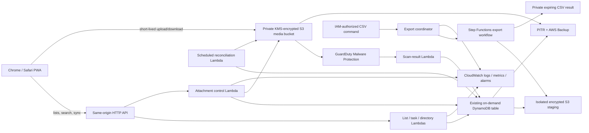

# Implementation Plan: Enhanced List Management

**Branch**: `002-enhanced-list-management` | **Date**: 2026-07-23 | **Spec**: [spec.md](./spec.md)

**Input**: Feature specification from `/specs/002-enhanced-list-management/spec.md`

## Summary

Extend Na'aseh's existing React/TypeScript local-first PWA and single `us-west-2` serverless
AWS stack with a distinct List/ListItem aggregate, an all-user global item directory,
signed minor-unit values, group/locked visibility, administrator oversight reads, mixed
task/list search, accessible completion feedback, encrypted file attachments, and an
IAM-authorized CSV export command.

Lists, list items, directory items, attachments, and copy jobs use the existing versioned
DynamoDB/outbox/change-feed model. Authorized text records remain encrypted in IndexedDB and
search locally with MiniSearch. Attachment bytes transfer directly between the browser and
the existing private, versioned, SSE-KMS media bucket using short-lived capabilities; objects
remain unavailable until managed malware inspection succeeds. The export command invokes an
isolated serverless workflow that captures a consistent DynamoDB point-in-time export,
projects only current tasks/subtasks and attachment metadata into CSV, and makes the verified
result briefly available from private encrypted S3.

### Architecture



## Technical Context

**Language/Version**: TypeScript 5.8 for browser, Lambda, shared packages, and AWS CDK;
React 19.1; Node.js 24 on AWS Lambda; Python 3.12+ for `scripts/export_todos.py`

**Primary Dependencies**: Existing React, Vite, Workbox PWA support, Dexie 4, MiniSearch 7,
Zod 3, AWS SDK v3, AWS CDK v2, Web Crypto, `@naaseh/observability`, Boto3, and Python
standard-library `argparse`/`csv`/`hashlib`; managed Amazon GuardDuty Malware
Protection for S3 for attachment inspection

**Storage**: Existing single on-demand DynamoDB table for current records, revisions,
feeds, mutations, copy/export jobs, attachment metadata, and blob references; encrypted
IndexedDB for authorized text records and outbox; existing private versioned SSE-KMS S3 media
bucket under opaque `attachments/` keys; isolated private SSE-KMS S3 prefixes for temporary
raw export and CSV output; existing DynamoDB PITR and AWS Backup

**Testing**: Vitest unit/component/property tests; contract tests for OpenAPI, sync, attachment,
and command schemas; isolated DynamoDB/S3 integration tests; Python unit tests; Playwright
Chromium/WebKit desktop/iPhone/iPad journeys with axe; security, performance, backup, and
restore validation; manual real-device Safari audio verification

**Target Platform**: Installable responsive web application and IAM-authorized operator
command backed by one `us-west-2` serverless AWS deployment

**Supported Browsers**: Current stable Chrome and Safari/WebKit, including supported iPhone
and iPad ordinary-tab and installed Home Screen modes

**Project Type**: TypeScript monorepo with browser PWA, serverless API, shared domain/contracts,
AWS infrastructure as code, and a bounded Python administrative command

**Performance Goals**: Completion/lock/reset/total feedback within 200 ms; 50,000-record
authorized local search within 1 second p95; 1,000-item list input delay below 200 ms p95;
accepted logical copies of 1,000 items complete within 10 seconds p95; attachment progress
updates at least every two seconds

**Constraints**: One active AWS Region (`us-west-2`); no OpenSearch or always-on compute;
one deployment currency with signed integer minor units; 1,000 items per planned validation
fixture; initial maximum 10 attachments per parent and 25 MiB per file; no public S3 access;
no attachment bytes, S3 keys, short-lived URLs, query text, protected names/memos, credentials,
or hidden-memo plaintext in logs or CSV

**Offline Strategy**: Lists, items, directory entries, attachment metadata, preferences, and
pending text mutations use the existing encrypted IndexedDB plus atomic outbox. Pull storage
becomes entity-generic and atomically commits records, tombstones, authorization purges, and
cursor changes. File bytes are not stored automatically offline: selection and upload are
deferred until connected, and downloads require connectivity unless the browser already owns
an ordinary user-controlled download outside application storage.

**Security & Data Boundaries**: Global unlocked lists are readable by active users; unlocked
group lists by owner/current members/admin; locked lists and private tasks by owner/admin.
Only owners mutate tasks/lists/items; administrators gain audited ordinary-content read access,
not implicit mutation rights. Hidden memo plaintext retains the existing PIN/decryption
boundary. Directory entries are intentionally writable by every active user with revision
history. Attachment authorization always resolves the current parent, clean scan status, and
exact S3 object version. CSV export requires a narrowly authorized IAM operator and stages
encrypted raw table-export data behind a workflow-only role.

**AWS Architecture & Cost Impact**: Reuse API Gateway, Lambda, one on-demand DynamoDB table,
the existing media bucket/data key/backup plan, CloudWatch, and the consolidated stack. Add
GuardDuty Malware Protection scoped to `attachments/`, EventBridge-driven scan finalization,
scheduled reconciliation, and a usage-priced Step Functions export workflow with short-lived
encrypted staging. Principal costs are S3 bytes/requests/versions/downloads, GuardDuty
objects and bytes scanned, backup storage/restore tests, DynamoDB list/revision/feed writes,
point-in-time exports, Lambda/Step Functions execution, and logs. Direct S3 transfer and
logical blob reuse avoid Lambda byte proxying and attachment duplication.

**CloudWatch Observability**: Structured allowlisted events include correlation/mutation/export
IDs, safe actor/parent/attachment/list IDs, operation, privileged-read flag, outcome, latency,
retry/conflict/scan classification, byte count, and row count. Audit events retain 90 days;
ordinary application logs retain 30 days. Metrics/alarms cover authorization denials,
administrator reads, list conflicts, directory contention, group-purge failures, stalled or
threat-positive uploads, reconciliation discrepancies, copy/export failures, S3/KMS denials,
backup failures, and restore-test failures. Content, file names, URLs, object keys, checksums,
query terms, and CSV values are excluded from logs.

**Scale/Scope**: Up to 50 provisioned users and 50,000 combined active tasks, lists, and list
items; lists validated to 1,000 items; up to 10 files per parent and 25 MiB per file; modest
personal-workspace mutation and attachment volume. Revisit search, feed sharding, file limits,
and export architecture before exceeding these bounds.

## Constitution Check

_GATE: Passed before Phase 0 research and re-checked after Phase 1 design._

- **Security and data boundaries — PASS**: Central policies cover global, group, owner,
  locked, administrator, attachment, offline-cache, search, copy, and export paths. S3 is
  private, encrypted, malware-gated, and accessed only through short-lived capabilities.
- **Data durability and observability — PASS**: Versioned entities, immutable revisions,
  idempotent mutations, hidden-until-complete copies, checksums, S3 version IDs, two-phase
  deletion, reconciliation, PITR/AWS Backup, safe structured logs, and alarms address loss,
  partial failure, replay, and recovery.
- **Browser offline operation and resynchronization — PASS**: New text entities use encrypted
  IndexedDB/outbox/cursors with generic atomic pull and visible conflicts. Attachment byte
  transfer is explicitly deferred offline instead of making a false durability claim.
- **Supported browsers — PASS**: Chromium/WebKit automation covers responsive touch, keyboard,
  reduced motion, blocked audio, file selection, progress, and offline states; audible output
  receives manual Safari/iPhone/iPad validation.
- **Automated testing — PASS**: Domain, component, contract, integration, security, performance,
  restore, Python CLI, Playwright, and accessibility coverage is planned.
- **Performance and AWS architecture — PASS**: All additions are managed/on-demand serverless;
  local search remains within measured v1 bounds; limits, budgets, cost drivers, and cheaper
  rejected alternatives are explicit.
- **Simplicity, review, comments, and documentation — PASS**: Existing packages, table, media
  bucket, key, backup plan, PWA data layer, and one deployable stack are extended. Added
  workflow complexity is confined to attachment safety and consistent sensitive export.

### Post-Design Re-check

Phase 1 contracts require parent-first authorization, non-disclosing failures, immutable clean
S3 versions, short URL lifetimes, malware fail-closed behavior, generic authorized feeds,
atomic revocation purges, fixed CSV fields, and atomic command output. Data entities and
transitions make copy, upload, scan, delete, reset, lock, conflict, and export recovery
explicit. No clarification marker or unapproved constitutional violation remains.

## Key Technical Decisions

1. Keep List/ListItem separate from Task/Subtask; store each item as a versioned entity.
2. Use opaque sortable order keys and derive totals from signed integer minor units.
3. Resolve directory links from current synchronized directory data with snapshots and
   explicit tri-state overrides; do not fan out writes on global edits.
4. Represent task locking with the existing private visibility state; add role-aware
   public-or-owner-or-admin reads consistently across API, sync, search, and cache.
5. Extend feeds to `PUBLIC`, `OWNER#{id}`, `GROUP#{id}`, and sharded `ADMIN` audiences;
   membership/lock changes emit tombstones and authorization-control purge events.
6. Keep mixed authorized search local with MiniSearch and group list-item hits under one list.
7. Reuse the existing media bucket and data KMS key under opaque attachment keys; use direct,
   checksum-bound transfers and retain exact S3 version IDs.
8. Fail closed until GuardDuty marks an attachment clean; use tag-based S3 defense in depth.
9. Separate Attachment from immutable AttachmentBlob/BlobReference so authorized list copies
   can share already-scanned bytes without sharing authorization or deletion lifecycle.
10. Defer offline file selection/upload; never persist arbitrary attachment bytes in IndexedDB
    or the service-worker cache.
11. Centralize visual/audio completion feedback; sound starts synchronously from user activation
    and playback failure never changes persistence.
12. Use an IAM-authorized Python command plus isolated exact-snapshot export workflow; never
    allow the command to scan DynamoDB or expose raw S3 identifiers.
13. Publish copied lists and exported files only after complete validation; resumable jobs use
    stable idempotency keys and hidden intermediate state.

## Project Structure

### Documentation (this feature)

```text
specs/002-enhanced-list-management/
├── plan.md
├── research.md
├── data-model.md
├── quickstart.md
├── contracts/
│   ├── openapi.yaml
│   ├── sync-protocol.md
│   ├── attachments.md
│   └── export-todos-cli.md
└── checklists/
    └── requirements.md
```

### Source Code (repository root)

```text
apps/
├── api/src/
│   ├── attachments/
│   ├── directory/
│   ├── exports/
│   ├── lists/
│   ├── sync/
│   ├── tasks/
│   └── shared/
└── web/src/
    ├── db/
    ├── features/
    │   ├── attachments/
    │   ├── lists/
    │   ├── postit/
    │   ├── search/
    │   └── tasks/
    ├── search/
    ├── sync/
    └── styles/

packages/
├── contracts/src/
├── domain/src/
├── observability/
└── test-fixtures/

infra/
├── lib/
│   ├── api-stack.ts
│   ├── backup-stack.ts
│   ├── export-stack.ts
│   ├── media-stack.ts
│   ├── naaseh-stack.ts
│   └── observability-stack.ts
└── test/

scripts/
├── export_todos.py
└── tests/

tests/
├── contract/
├── e2e/
├── integration/
├── performance/
├── restore/
└── security/

docs/
├── operations/
└── security/
```

**Structure Decision**: Extend the existing npm-workspace monorepo and consolidated deployable
stack. New API/UI folders isolate feature concerns without creating a new application or data
service. The Python export command remains a thin IAM client; domain validation, snapshot
generation, authorization, auditing, and file lifecycle remain server-side.

## Delivery Phases

1. **Domain and policy foundation**: List, item, directory, money/override, attachment, blob,
   copy/export job schemas; administrator read policy; generic revisions and sync entity types.
2. **List persistence and sync**: DynamoDB keys/transactions, group/admin feeds, encrypted
   IndexedDB migrations, generic pull/outbox/conflict handling, and revocation purges.
3. **List UX and search**: Responsive list editor, order controls, totals, global directory,
   reset/lock/group/copy controls, mixed MiniSearch index, and result-type selector.
4. **Completion feedback**: Shared crossing animation/live-region behavior, bundled offline
   scrunch sound, sound preference, reduced-motion and blocked-playback handling.
5. **Attachment pipeline**: Direct transfer contracts, media-bucket policy/lifecycle/CORS,
   GuardDuty finalization, metadata sync, UI states, download authorization, deletion, copy
   references, reconciliation, backup, and restore validation.
6. **CSV export**: Isolated staging, point-in-time export/transform workflow, coordinator,
   IAM policy, Python command, fixed schema, integrity checks, atomic destination handling.
7. **Hardening and release gates**: Full authorization matrix, offline/conflict/failure paths,
   Chromium/WebKit/iPhone/iPad coverage, search/copy/export performance, CloudWatch alarms,
   recovery exercise, cost review, docs, and final-diff security review.

## Complexity Tracking

| Complexity | Why Needed | Simpler Alternative Rejected Because |
|---|---|---|
| Attachment/Blob/Reference split plus scan and reconciliation functions | Independent copied attachments, malware quarantine, exact object-version recovery, and orphan-free deletion | Copying bytes multiplies storage/scan cost and misses the 10-second target; one attachment row cannot safely coordinate shared immutable bytes |
| Temporary exact DynamoDB export with isolated workflow-only S3 staging | Produce one consistent all-field CSV without granting the command database access | A paged task-only scan is cheaper and narrower but is not globally snapshot-consistent during concurrent writes; whole-table staging is accepted only with KMS encryption, least privilege, short lifecycle, prompt deletion, and audit |

