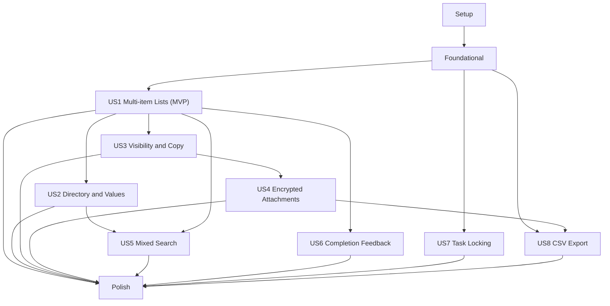

# Tasks: Enhanced List Management

**Input**: Design documents from `/specs/002-enhanced-list-management/`

**Prerequisites**: plan.md, spec.md, research.md, data-model.md, contracts/, quickstart.md

**Tests**: Automated unit, integration, contract, security, performance, restore, and Playwright
Chromium/WebKit tests are required by the constitution in proportion to each story's risk.

**Organization**: Tasks are grouped by user story so each phase produces an independently
testable increment. Tests are listed before the implementation they prove and must fail first.

## Format: `[ID] [P?] [Story] Description`

- **[P]**: Can run in parallel because it uses different files and does not depend on incomplete work
- **[Story]**: Maps the task to a user story from spec.md
- Every checklist task includes an exact repository-relative file path

## Phase 1: Setup (Shared Infrastructure)

**Purpose**: Establish feature configuration, fixtures, and contract generation inputs without
changing application behavior.

- [X] T001 Add deployment currency, attachment size/count, upload/download expiry, and export lifecycle defaults to infra/lib/config.ts and .env.example
- [X] T002 [P] Add mixed task/list/directory/attachment builders and 50,000-record fixtures to packages/test-fixtures/src/enhanced-list-management.ts
- [X] T003 [P] Add feature test tags and desktop/iPhone/iPad Chromium/WebKit project coverage to playwright.config.ts
- [X] T004 [P] Add feature API schema exports and generation entry points to packages/contracts/src/index.ts and packages/contracts/src/openapi.ts
- [X] T005 Add enhanced-list release-gate groupings for unit, contract, security, performance, and browser suites to tools/run-local-release-gates.mjs

---

## Phase 2: Foundational (Blocking Prerequisites)

**Purpose**: Generalize domain, authorization, persistence, synchronization, and observability
boundaries used by every story.

**⚠️ CRITICAL**: No user-story implementation begins until this phase passes.

### Foundational Tests

- [X] T006 [P] Add generic entity revision, mutation-envelope, stable-result, and conflict-schema tests to packages/domain/test/enhanced-sync.test.ts
- [X] T007 [P] Add OpenAPI v2 schema/reference and backward-compatibility tests to tests/contract/enhanced-openapi.contract.test.ts
- [X] T008 [P] Add owner/global/group/locked/admin parent-policy matrix and non-disclosing-denial tests to tests/security/content-authorization.security.test.ts
- [X] T009 [P] Add encrypted IndexedDB migration, interrupted migration, quota failure, and outbox-preservation tests to apps/web/test/db/enhanced-schema-migration.test.ts
- [X] T010 [P] Add generic multi-entity pull, deduplication, atomic cursor, parse failure, and tombstone tests to tests/integration/enhanced-sync-roundtrip.test.ts

### Foundational Implementation

- [X] T011 Generalize entity revisions and safe changed-field handling in packages/domain/src/revision.ts and packages/domain/src/index.ts
- [X] T012 Generalize mutation entity types, semantic operations, stable results, and typed conflicts in packages/domain/src/sync.ts
- [X] T013 Implement centralized role-aware parent read/edit policy interfaces in packages/domain/src/authorization.ts
- [X] T014 Extend request/response Zod schemas for sync contract version 2 and feature entities in packages/contracts/src/openapi.ts
- [X] T015 Add List, ListItem, Directory, Attachment, Blob, CopyJob, and ExportJob key builders to apps/api/src/shared/keys.ts
- [X] T016 Add conditional current-record, revision, mutation-result, feed-change, and job-checkpoint transaction primitives to apps/api/src/shared/store.ts
- [X] T017 Generalize server sync dispatch, audience union/deduplication, and stable per-entity results in apps/api/src/sync/sync-service.ts and apps/api/src/sync/handlers.ts
- [X] T018 Add public, owner, group, administrator, and access-control feed helpers with sharding to apps/api/src/sync/change-feed-repository.ts
- [X] T019 Add encrypted stores and indexes for lists, list items, directory items, attachments, and jobs in the next Dexie migration in apps/web/src/db/database.ts
- [X] T020 Generalize encrypted entity serialization, atomic pull storage, tombstones, and cursor commits in apps/web/src/sync/sync-engine.ts and apps/web/src/db/outbox.ts
- [X] T021 Add generic conflict persistence/resolution and authorization-change quarantine behavior to apps/web/src/sync/conflict-resolution.ts
- [X] T022 Add centralized API authorization adapters that load canonical parent records and active roles/memberships in apps/api/src/shared/content-authorization.ts
- [X] T023 Register list, directory, attachment, task-lock, and export handler entry points and least-privilege environment variables in infra/lib/api-stack.ts
- [X] T024 Add safe event names, redaction allowlists, 30/90-day retention classes, metrics, and alarm dimensions for the feature to packages/observability/src/logger.ts and infra/lib/observability-stack.ts
- [X] T025 Export all new domain and contract types from packages/domain/src/index.ts and packages/contracts/src/index.ts

**Checkpoint**: Contract v2, generic encrypted sync, central policy, storage migration, and safe
observability are ready for story work.

---

## Phase 3: User Story 1 - Create and Complete Multi-item Lists (Priority: P1) 🎯 MVP

**Goal**: Create a named list with independently ordered lightweight items that can be added,
edited, completed, restored, and removed without creating tasks.

**Independent Test**: Create a shopping list, add and reorder three items, complete and restore
one, reload online/offline, and verify durable names, ordering, states, revisions, and no Task rows.

### Tests for User Story 1

- [X] T026 [P] [US1] Add List/ListItem schema, ordering, transition, completion, removal, and invariant tests to packages/domain/test/list.test.ts
- [X] T027 [P] [US1] Add list and item endpoint request/response/idempotency/version contract tests to tests/contract/lists.contract.test.ts
- [X] T028 [P] [US1] Add list repository transaction, immutable revision, replay, conflict, and partial-failure tests to tests/integration/list-repository.test.ts
- [X] T029 [P] [US1] Add encrypted local list/item repository, outbox, restart, quota, and reconnect tests to apps/web/test/db/list-repository.test.ts
- [X] T030 [P] [US1] Add Chromium/WebKit desktop/iPhone/iPad create-edit-reorder-complete-remove online/offline journeys to tests/e2e/lists-basic.spec.ts

### Implementation for User Story 1

- [X] T031 [P] [US1] Implement List/ListItem Zod schemas, opaque order-key generation/rebalance, and semantic transitions in packages/domain/src/list.ts
- [X] T032 [US1] Implement list/item DynamoDB queries, conditional writes, revisions, mutation replay, and feed changes in apps/api/src/lists/list-repository.ts
- [X] T033 [US1] Implement owner-only create, edit, reorder, complete, reopen, remove, archive, and conflict rules in apps/api/src/lists/list-service.ts
- [X] T034 [US1] Implement list/item HTTP handlers and actionable problem responses in apps/api/src/lists/handlers.ts and apps/api/src/lists/handler.ts
- [X] T035 [US1] Register list/item/completion routes, schemas, CSRF, mutation IDs, and If-Match behavior in packages/contracts/src/openapi.ts and infra/lib/api-stack.ts
- [X] T036 [P] [US1] Implement encrypted local list/item records and atomic entity-plus-outbox mutations in apps/web/src/db/list-repository.ts
- [X] T037 [US1] Integrate list/listItem push and pull payload parsing with the generic sync engine in apps/web/src/sync/sync-engine.ts
- [X] T038 [P] [US1] Build responsive named-list creation/editing and empty/loading/error states in apps/web/src/features/lists/ListPage.tsx and apps/web/src/features/lists/ListForm.tsx
- [X] T039 [US1] Build item add/edit/reorder/remove and accessible completion controls in apps/web/src/features/lists/ListItemRow.tsx and apps/web/src/features/lists/ListItems.tsx
- [X] T040 [US1] Add list routes, navigation, pending-sync state, and conflict entry points to apps/web/src/app/router.tsx and apps/web/src/features/lists/list-client.ts
- [X] T041 [US1] Add list mutation/conflict/retry structured events with protected-name exclusions to apps/api/src/lists/telemetry.ts
- [X] T042 [US1] Verify the User Story 1 independent journey and record results in specs/002-enhanced-list-management/validation-results.md

**Checkpoint**: The MVP supports durable multi-item lists online and offline without directory,
sharing, attachments, or enhanced search.

---

## Phase 4: User Story 2 - Reuse Directory Items and Track List Value (Priority: P1)

**Goal**: Reuse globally editable item definitions, support local name/value overrides and
reset, and derive an exact signed total at the bottom of each list.

**Independent Test**: Add a valued global item to a list, override name/value, edit the global
entry as another user, reset both fields, enter negative and positive values, and verify totals.

### Tests for User Story 2

- [X] T043 [P] [US2] Add signed minor-unit, bounds, tri-state override, snapshot fallback, reset, and total property tests to packages/domain/test/directory-money.test.ts
- [X] T044 [P] [US2] Add directory CRUD and reset-to-global endpoint contract tests to tests/contract/directory.contract.test.ts
- [X] T045 [P] [US2] Add all-active-user edit, version conflict, archive, replay, and no-fanout integration tests to tests/integration/directory-repository.test.ts
- [X] T046 [P] [US2] Add linked-item offline edit/reset/global-update/reindex and conflict tests to apps/web/test/db/directory-list-link.test.ts
- [X] T047 [P] [US2] Add Chromium/WebKit global-directory, override, reset-icon, signed-entry, and total journeys to tests/e2e/list-directory-values.spec.ts

### Implementation for User Story 2

- [X] T048 [P] [US2] Implement signed safe minor-unit parsing, configured currency, formatting inputs, and exact total helpers in packages/domain/src/money.ts
- [X] T049 [P] [US2] Implement GlobalDirectoryItem schema, lifecycle, snapshot, effective-field, tri-state override, and reset rules in packages/domain/src/directory-item.ts
- [X] T050 [US2] Implement directory current/revision queries and optimistic all-user writes in apps/api/src/directory/directory-repository.ts
- [X] T051 [US2] Implement directory CRUD/archive and semantic reset-to-current-global services in apps/api/src/directory/directory-service.ts
- [X] T052 [US2] Implement directory/reset handlers, pagination, problem responses, and safe audit events in apps/api/src/directory/handlers.ts and apps/api/src/directory/telemetry.ts
- [X] T053 [US2] Register directory and reset contracts/routes in packages/contracts/src/openapi.ts and infra/lib/api-stack.ts
- [X] T054 [P] [US2] Implement encrypted directory cache, local link resolution, snapshots, and pending mutations in apps/web/src/db/directory-repository.ts
- [X] T055 [P] [US2] Build global directory browse/create/edit/archive/add-to-list flows in apps/web/src/features/lists/GlobalDirectory.tsx
- [X] T056 [US2] Build value entry with default-cost/explicit-positive modes and accessible reset-to-global icon in apps/web/src/features/lists/ListItemValueEditor.tsx
- [X] T057 [US2] Derive and render locale-aware signed totals including completed/unvalued items in apps/web/src/features/lists/ListTotal.tsx
- [X] T058 [US2] Recompute linked effective fields/totals after directory sync without stale display in apps/web/src/features/lists/useEffectiveListItems.ts
- [X] T059 [US2] Verify the User Story 2 independent journey and append results to specs/002-enhanced-list-management/validation-results.md

**Checkpoint**: Lists support globally reusable items, exact signed values, overrides, reset, and totals.

---

## Phase 5: User Story 3 - Control Visibility and Copy Lists (Priority: P1)

**Goal**: Enforce global, group, locked, owner, and administrator read boundaries and create
independent hidden-until-ready copies of accessible lists.

**Independent Test**: Exercise every access path as owner/member/non-member/admin, revoke group
access while cached, copy each accessible list, and prove visibility, audit, purge, and independence.

### Tests for User Story 3

- [X] T060 [P] [US3] Add list visibility precedence, preserved-group-on-lock, owner mutation, admin read-only, and copy-domain tests to packages/domain/test/list-authorization-copy.test.ts
- [X] T061 [P] [US3] Add list direct-read, group, lock, copy-job, and non-disclosing endpoint contract tests to tests/contract/list-sharing-copy.contract.test.ts
- [X] T062 [P] [US3] Add PUBLIC/OWNER/GROUP/ADMIN transition, tombstone, dedupe, and revocation-control integration tests to tests/integration/list-audience-sync.test.ts
- [X] T063 [P] [US3] Add chunked copy checkpoint, deterministic child ID, replay, hidden-destination, rollback, and source-independence tests to tests/integration/list-copy.test.ts
- [X] T064 [P] [US3] Add administrator visibility, mutation denial, safe audit, and cache-leakage tests to tests/security/list-sharing.security.test.ts
- [X] T065 [P] [US3] Add Chromium/WebKit global/group/locked/admin/revocation/copy responsive journeys to tests/e2e/list-sharing-copy.spec.ts

### Implementation for User Story 3

- [X] T066 [US3] Implement canonical list owner/global/group/locked/admin read and owner-only mutation policy in apps/api/src/lists/list-authorization.ts
- [X] T067 [US3] Implement atomic list audience transition upserts/tombstones and administrator shards in apps/api/src/lists/list-audience.ts
- [X] T068 [US3] Emit group-membership revocation control events and forced-role rebootstrap signals in apps/api/src/groups/group-service.ts and apps/api/src/sync/change-feed-repository.ts
- [X] T069 [US3] Implement CopyJob schema, deterministic mapping, progress, failure, and publish transitions in packages/domain/src/copy-job.ts
- [X] T070 [US3] Implement resumable chunked list/item copy persistence with hidden destination and stable replay in apps/api/src/lists/list-copy-repository.ts
- [X] T071 [US3] Implement copy authorization, point-in-time source capture, retry/resume, cleanup, and final feed publication in apps/api/src/lists/list-copy-service.ts
- [X] T072 [US3] Implement copy start/status handlers and safe progress/problem responses in apps/api/src/lists/copy-handlers.ts
- [X] T073 [US3] Register copy contracts/routes and caller-owned job views in packages/contracts/src/openapi.ts and infra/lib/api-stack.ts
- [X] T074 [P] [US3] Build accessible locked/unlocked icons, group selector, visibility explanation, and owner controls in apps/web/src/features/lists/ListVisibilityControl.tsx
- [X] T075 [P] [US3] Build copy action, progress, retry/failure, and ready navigation in apps/web/src/features/lists/CopyListAction.tsx
- [X] T076 [US3] Implement atomic group-revocation purge of lists/items/search docs/capabilities and quarantine pending writes in apps/web/src/sync/privacy-purge.ts
- [X] T077 [US3] Add administrator read audit events and non-admin mutation-denial metrics in apps/api/src/lists/telemetry.ts
- [X] T078 [US3] Show only authorized lists in navigation and route loaders while preserving non-disclosing failures in apps/web/src/features/lists/ListIndexPage.tsx
- [X] T079 [US3] Verify the User Story 3 independent journey and append results to specs/002-enhanced-list-management/validation-results.md

**Checkpoint**: Visibility and copy rules are enforced across live data, feeds, caches, direct
access, UI, and audit paths.

---

## Phase 6: User Story 4 - Attach Files Securely (Priority: P1)

**Goal**: Attach private encrypted S3 files to editable tasks/list items, quarantine until
malware-clean, authorize every download through the parent, and recover/delete safely.

**Independent Test**: Upload, scan, download, copy-reference, revoke, delete, reconcile, and
restore allowed/blocked files across every parent visibility and actor class.

### Tests for User Story 4

- [X] T080 [P] [US4] Add Attachment/Blob/Reference/UploadSession lifecycle and invariant tests to packages/domain/test/attachment.test.ts
- [X] T081 [P] [US4] Add initiate/complete/status/download/delete schema, expiry, and no-store contract tests to tests/contract/attachments.contract.test.ts
- [X] T082 [P] [US4] Add parent-first owner/member/non-member/admin and guessed-ID denial tests to tests/security/attachment-authorization.security.test.ts
- [X] T083 [P] [US4] Add upload replay, checksum/version/encryption mismatch, scan event ordering, delete, and reconciliation integration tests to tests/integration/attachment-lifecycle.test.ts
- [X] T084 [P] [US4] Add clean-only tag policy, KMS, public-block, CORS, lifecycle, GuardDuty, and least-privilege synthesis tests to infra/test/attachment-infrastructure.test.ts
- [X] T085 [P] [US4] Add browser cache exclusion, offline deferral, interrupted transfer, progress, and revocation purge tests to apps/web/test/features/attachments.test.tsx
- [X] T086 [P] [US4] Add Chromium/WebKit upload/scanning/failure/download/remove responsive journeys to tests/e2e/attachments.spec.ts
- [X] T087 [P] [US4] Add attachment/blob/reference backup-manifest and isolated-restore mismatch tests to tests/restore/attachment-restore.test.ts

### Implementation for User Story 4

- [X] T088 [P] [US4] Implement Attachment, AttachmentBlob, BlobReference, UploadSession schemas and guarded transitions in packages/domain/src/attachment.ts
- [X] T089 [US4] Implement attachment/blob/reference/session keys, lifecycle indexes, conditional transactions, and parent queries in apps/api/src/attachments/attachment-repository.ts
- [X] T090 [US4] Implement parent-first authorization, 10-file/25-MiB/type policy, sanitized names, and non-disclosing failures in apps/api/src/attachments/attachment-authorization.ts and apps/api/src/attachments/file-policy.ts
- [X] T091 [US4] Implement idempotent initiate and five-minute checksum/header/SSE-KMS-bound S3 upload grants in apps/api/src/attachments/upload-service.ts
- [X] T092 [US4] Implement exact-version size/checksum/type/encryption verification and transition to scanning in apps/api/src/attachments/completion-service.ts
- [X] T093 [US4] Implement idempotent GuardDuty result mapping, fail-closed tag/version matching, threat handling, and alerts in apps/api/src/attachments/scan-result-handler.ts
- [X] T094 [US4] Implement current-parent reauthorization and 60-second exact-version no-store download grants in apps/api/src/attachments/download-service.ts
- [X] T095 [US4] Implement two-phase delete, reference release, zero-reference delete markers, retry, and safe lifecycle events in apps/api/src/attachments/deletion-service.ts
- [X] T096 [US4] Implement scheduled stale-upload/stalled-scan/missing-object/orphan/blob-reference reconciliation in apps/api/src/attachments/reconciliation-handler.ts
- [X] T097 [US4] Implement attachment HTTP handlers for initiate, metadata/status, complete, download, retry, and delete in apps/api/src/attachments/handlers.ts and apps/api/src/attachments/handler.ts
- [X] T098 [US4] Register attachment contracts/routes, scan event handler, and reconciliation schedule in packages/contracts/src/openapi.ts and infra/lib/api-stack.ts
- [X] T099 [US4] Configure attachment-prefix CORS, Bucket Keys, incomplete/rejected/noncurrent lifecycle, GuardDuty plan, result tags, and clean-only read policy in infra/lib/media-stack.ts
- [X] T100 [US4] Grant least-privilege S3/KMS/tag/EventBridge access to attachment, scan, and reconciliation functions in infra/lib/api-stack.ts
- [X] T101 [US4] Add scan threat/failure/latency, stalled upload, orphan, authorization, bytes, and reconciliation metrics/alarms to infra/lib/observability-stack.ts
- [X] T102 [P] [US4] Implement encrypted attachment metadata cache and ensure no file bytes/capabilities enter IndexedDB or Cache API in apps/web/src/db/attachment-repository.ts and apps/web/src/app/service-worker-update.ts
- [X] T103 [US4] Implement browser hashing, upload progress/retry, scanning polling, offline deferral, and download capability handling in apps/web/src/features/attachments/attachment-client.ts
- [X] T104 [US4] Build accessible picker/policy/progress/scanning/failure/download/remove UI for tasks and list items in apps/web/src/features/attachments/AttachmentPanel.tsx
- [X] T105 [US4] Extend list copy to create new Attachment/BlobReference rows for clean immutable blobs without copying bytes in apps/api/src/lists/list-copy-service.ts
- [X] T106 [US4] Extend backup manifests, AWS Backup validation, reconciliation-before-exposure, and quarterly restore probes in apps/api/src/crypto-recovery/backup-manifest.ts and apps/api/src/crypto-recovery/restore-testing-validator.ts
- [X] T107 [US4] Verify the User Story 4 independent journey and append results to specs/002-enhanced-list-management/validation-results.md

**Checkpoint**: Encrypted attachments are uploadable, malware-gated, authorization-safe, copied
logically, recoverable, and free of silent object/metadata loss.

---

## Phase 7: User Story 5 - Find Lists and To-do Items Together (Priority: P2)

**Goal**: Search authorized tasks and lists locally with All, Lists, and To-do Lists selection,
grouping list-item hits under one parent without leaking inaccessible content.

**Independent Test**: Seed matching mixed records at every visibility, run every selector online
and offline, revoke access, and verify results/counts/context/performance.

### Tests for User Story 5

- [X] T108 [P] [US5] Add mixed document normalization, type filtering, parent grouping, directory reindex, and default-All unit tests to apps/web/test/search/mixed-search.test.ts
- [X] T109 [P] [US5] Add locked/group/admin/revoked content non-disclosure tests for results/counts/snippets/timing to tests/security/mixed-search-privacy.security.test.ts
- [X] T110 [P] [US5] Add 50,000 mixed-record search/reindex performance tests to tests/performance/mixed-local-search.test.ts
- [X] T111 [P] [US5] Add Chromium/WebKit All/Lists/To-do Lists online/offline and purge journeys to tests/e2e/mixed-search.spec.ts

### Implementation for User Story 5

- [X] T112 [P] [US5] Generalize MiniSearch documents and incremental index operations for task/list/list-item identities in apps/web/src/search/task-index.ts
- [X] T113 [US5] Implement list-item hit grouping, parent match context, type filtering, and deduplication in apps/web/src/search/task-search.ts
- [X] T114 [US5] Reindex linked list-item documents after directory changes and mark rebuild state without stale results in apps/web/src/search/index-migration.ts
- [X] T115 [US5] Extend safe search state with all/lists/todos default-All selector while excluding query text from URLs in apps/web/src/features/search/search-state.ts
- [X] T116 [P] [US5] Add accessible content-type dropdown, active-state text, counts, and empty states in apps/web/src/features/search/TaskFilters.tsx
- [X] T117 [US5] Render grouped list results and preserve navigation/search state across task/list routes in apps/web/src/features/search/SearchResults.tsx and apps/web/src/features/search/TaskSearchBar.tsx
- [X] T118 [US5] Integrate search purge/reindex ordering with atomic sync cursor commits in apps/web/src/sync/privacy-purge.ts
- [X] T119 [US5] Verify the User Story 5 independent journey and append results to specs/002-enhanced-list-management/validation-results.md

**Checkpoint**: Authorized mixed search is responsive online/offline and cannot disclose revoked
or inaccessible content.

---

## Phase 8: User Story 6 - Receive Clear Completion Feedback (Priority: P2)

**Goal**: Add best-effort scrunch audio to post-it completion and accessible crossing animations
to task/list completion without coupling feedback to persistence.

**Independent Test**: Complete/reopen each item type by pointer and keyboard with sound on/off,
blocked playback, reduced motion, offline persistence, stable focus, and live announcements.

### Tests for User Story 6

- [X] T120 [P] [US6] Add sound preference, gesture-timed playback, rejected-playback, shared announcement, focus, and reduced-motion component tests to apps/web/test/features/completion-feedback.test.tsx
- [X] T121 [P] [US6] Extend post-it completion tests for sound-on/muted/offline/reopen behavior in apps/web/test/features/post-it-view.test.tsx
- [X] T122 [P] [US6] Add Chromium/WebKit pointer/keyboard/reduced-motion/blocked-audio/task/list/post-it journeys to tests/e2e/completion-feedback.spec.ts

### Implementation for User Story 6

- [X] T123 [P] [US6] Add the licensed versioned scrunch sound and attribution to apps/web/public/sounds/post-it-scrunch.ogg and apps/web/public/sounds/README.md
- [X] T124 [P] [US6] Persist a default-on authenticated completion-sound preference in apps/web/src/db/preferences-repository.ts
- [X] T125 [US6] Implement one gesture-safe nonblocking audio/animation/live-region completion service in apps/web/src/features/tasks/useCompletionFeedback.ts
- [X] T126 [US6] Add 250–400 ms left-to-right strike, persistent completed styling, and reduced-motion immediate state to apps/web/src/styles/app.css
- [X] T127 [US6] Integrate shared feedback before asynchronous persistence in apps/web/src/features/postit/usePostItCompletion.ts and apps/web/src/features/postit/PostItNote.tsx
- [X] T128 [US6] Integrate shared completion feedback and stable focus in apps/web/src/features/tasks/TaskRow.tsx and apps/web/src/features/lists/ListItemRow.tsx
- [X] T129 [US6] Add an accessible Completion sounds on/off control to apps/web/src/features/tasks/CompletionSoundSetting.tsx
- [X] T130 [US6] Verify the User Story 6 independent journey and append automated/manual Safari evidence to specs/002-enhanced-list-management/validation-results.md

**Checkpoint**: Completion remains durable and accessible even when sound or animation is blocked.

---

## Phase 9: User Story 7 - Lock To-do Items (Priority: P2)

**Goal**: Present existing public/private task visibility as unlocked/locked, allow owner
transitions, and give administrators audited ordinary-content read access without edit rights.

**Independent Test**: Lock/unlock a task as owner, test direct/search/cache access as another
user and administrator, verify icons/audit/purge, and prove hidden memo plaintext stays protected.

### Tests for User Story 7

- [X] T131 [P] [US7] Add task lock mapping, owner/admin read, non-owner denial, and hidden-memo boundary tests to packages/domain/test/task-lock.test.ts
- [X] T132 [P] [US7] Add task lock endpoint, If-Match, mutation replay, and response contract tests to tests/contract/task-lock.contract.test.ts
- [X] T133 [P] [US7] Add private-task admin read/mutation denial, audit redaction, direct-ID, and hidden-memo tests to tests/security/task-lock-admin.security.test.ts
- [X] T134 [P] [US7] Add public/private/admin feed transitions and cache purge integration tests to tests/integration/task-lock-sync.test.ts
- [X] T135 [P] [US7] Add Chromium/WebKit lock-icon, search disappearance, admin view, and reduced-viewport journeys to tests/e2e/task-lock.spec.ts

### Implementation for User Story 7

- [X] T136 [US7] Extend task read helpers for public-or-owner-or-admin and preserve hidden-memo decryption checks in packages/domain/src/task.ts
- [X] T137 [US7] Implement semantic lock/unlock transition through visibility with owner-only mutation in apps/api/src/tasks/task-policy.ts and apps/api/src/tasks/task-service.ts
- [X] T138 [US7] Implement task lock handler, version conflict, idempotency, non-disclosing denial, and audit flag in apps/api/src/tasks/handlers.ts
- [X] T139 [US7] Extend task public/owner/admin audience transitions and administrator bootstrap reads in apps/api/src/tasks/privacy-transition.ts and apps/api/src/tasks/task-authorization.ts
- [X] T140 [US7] Register the task lock contract and route in packages/contracts/src/openapi.ts and infra/lib/api-stack.ts
- [X] T141 [P] [US7] Build distinct accessible locked/unlocked icon states and owner action control in apps/web/src/features/tasks/PrivacyControl.tsx
- [X] T142 [US7] Purge newly locked tasks from unauthorized encrypted caches/search before cursor advancement in apps/web/src/sync/privacy-purge.ts
- [X] T143 [US7] Verify the User Story 7 independent journey and append results to specs/002-enhanced-list-management/validation-results.md

**Checkpoint**: Task locking and administrator oversight work without weakening hidden-memo protection.

---

## Phase 10: User Story 8 - Export All To-do Data (Priority: P3)

**Goal**: Produce a consistent, complete, verified RFC 4180 CSV through an IAM-authorized command
without exposing database access, protected staging data, attachment bytes, or partial output.

**Independent Test**: Export a concurrent-write fixture containing every task/subtask field and
attachment metadata; verify snapshot fidelity, atomic mode-0600 output, denied access, failures,
cleanup, logging exclusions, and documented exit codes.

### Tests for User Story 8

- [X] T144 [P] [US8] Add ExportJob lifecycle, stable manifest, and safe failure-code tests to packages/domain/test/export-job.test.ts
- [X] T145 [P] [US8] Add start/status/acknowledge invocation and ready-result contract tests to tests/contract/export-todos.contract.test.ts
- [X] T146 [P] [US8] Add CSV fixed-header, quoting, Unicode/newline, hidden-memo, attachment JSON, and deterministic-order tests to tests/integration/export-transformer.test.ts
- [X] T147 [P] [US8] Add exact snapshot cutoff, retry/resume, raw cleanup, expired result, and unknown-outcome workflow tests to tests/integration/export-workflow.test.ts
- [X] T148 [P] [US8] Add denied IAM, no-public-access, no raw identifiers, no content logs, and least-privilege tests to tests/security/export-todos.security.test.ts
- [X] T149 [P] [US8] Add CLI argument/Region/overwrite/mode-0600/hash/row/header/atomic-rename/exit-code tests to scripts/tests/test_export_todos.py
- [X] T150 [P] [US8] Add CDK tests for isolated KMS staging, workflow-only IAM, Block Public Access, lifecycle, and coordinator output to infra/test/export-infrastructure.test.ts
- [X] T151 [P] [US8] Add 50,000-row bounded-memory workflow and streaming command performance tests to tests/performance/export-todos.test.ts

### Implementation for User Story 8

- [X] T152 [P] [US8] Implement ExportJob schema, manifest, lifecycle, and stable invocation/result types in packages/domain/src/export-job.ts
- [X] T153 [US8] Implement start/status/acknowledge authorization, idempotency, polling state, and safe audit responses in apps/api/src/exports/export-service.ts
- [X] T154 [US8] Implement coordinator Lambda request validation and stable response envelopes in apps/api/src/exports/coordinator-handler.ts
- [X] T155 [US8] Implement point-in-time export filtering and deterministic current task/subtask plus attachment-metadata CSV transformation in apps/api/src/exports/csv-transformer.ts
- [X] T156 [US8] Implement manifest hash/length/row verification, short-lived result capability, acknowledgement cleanup, and fail-safe expiration in apps/api/src/exports/result-service.ts
- [X] T157 [US8] Build isolated export KMS key, private staging/result storage, under-24-hour lifecycle, Step Functions workflow, and cleanup paths in infra/lib/export-stack.ts
- [X] T158 [US8] Add narrowly scoped coordinator/operator/workflow roles and deployment outputs to infra/lib/export-stack.ts and infra/lib/naaseh-stack.ts
- [X] T159 [US8] Implement secure Python start/poll/download/verify/fsync/atomic-rename/acknowledge behavior in scripts/export_todos.py
- [X] T160 [US8] Add export environment defaults and Python dependency/runtime documentation to .env.example and scripts/requirements.txt
- [X] T161 [US8] Add export failure/denial/duration/bytes/rows/cleanup metrics and protected-value redaction to infra/lib/observability-stack.ts and packages/observability/src/redaction.ts
- [X] T162 [US8] Document operator setup, sensitive output handling, cleanup, recovery, and exit codes in docs/operations/export-todos.md
- [X] T163 [US8] Verify the User Story 8 independent journey and append results to specs/002-enhanced-list-management/validation-results.md

**Checkpoint**: The export is consistent, complete, sensitive, auditable, and never appears
successful before local verification.

---

## Phase 11: Polish & Cross-Cutting Concerns

**Purpose**: Prove combined behavior, recovery, performance, cost, browser support, and final
constitutional compliance across all selected stories.

- [X] T164 [P] Add full owner/member/non-member/admin browse/direct/search/copy/cache/file/export authorization regression tests to tests/security/enhanced-content-boundaries.security.test.ts
- [X] T165 [P] Add combined offline restart, conflict, revocation, quota, retry, and no-silent-loss regression journeys to tests/e2e/enhanced-offline-resilience.spec.ts
- [X] T166 [P] Add 1,000-item render/reorder/total/copy-with-attachment p95 performance coverage to tests/performance/large-list.test.ts
- [X] T167 [P] Add structured-log allowlist tests proving names, memos, queries, filenames, checksums, keys, capabilities, CSV values, and secrets are excluded in tests/security/enhanced-observability.security.test.ts
- [X] T168 Add list/directory/attachment/export counts, keys, tags, references, and recovery invariants to apps/api/src/crypto-recovery/backup-manifest.ts
- [X] T169 Execute and document isolated DynamoDB/S3 attachment restore plus list/directory authorization probes in tests/restore/full-restore.test.ts and specs/002-enhanced-list-management/validation-results.md
- [X] T170 Validate all primary journeys on Chromium and WebKit desktop/iPhone/iPad, including touch, keyboard, reduced motion, blocked audio, file transfer, and no horizontal overflow in tests/e2e/enhanced-responsive.spec.ts
- [X] T171 Measure local search, UI acknowledgement, large-list, copy, upload progress, and export targets and record p50/p95 evidence in specs/002-enhanced-list-management/validation-results.md
- [X] T172 Review current us-west-2 DynamoDB, S3, KMS, GuardDuty, Backup, export, Step Functions, Lambda, transfer, restore-test, and log costs in docs/operations/aws-cost-review.md
- [X] T173 Update the authorization model for global/group/locked/admin/attachment/export boundaries and hidden-memo exception in docs/security/authorization-model.md
- [X] T174 Update backup, restore, reconciliation, malware quarantine, and exact-snapshot staging procedures in docs/operations/backup-recovery.md
- [X] T175 Document list, directory, attachment, search, sound, lock, and export user/administrator behavior in README.md
- [X] T176 Run every scenario in specs/002-enhanced-list-management/quickstart.md and record commands, outcomes, browser/device evidence, and applicable limitations in specs/002-enhanced-list-management/validation-results.md
- [X] T177 Run npm run validate, npm run test:python, npm run test:e2e, npm run test:performance, npm run test:observability, npm run cdk:synth, and npm run validate:pre-aws and record results in specs/002-enhanced-list-management/validation-results.md
- [X] T178 Re-review the final diff for correctness, unnecessary complexity, authorization, data durability, errors, logging, comments, test quality, browser support, and documentation in specs/002-enhanced-list-management/reviews/final-diff-review.md
- [X] T179 Resolve every failed constitutional gate or document a non-applicable rationale and final readiness decision in specs/002-enhanced-list-management/reviews/constitution-gates.md
- [X] T180 Confirm no unresolved tasks, placeholder text, unreviewed generated artifacts, or undocumented operational steps remain in specs/002-enhanced-list-management/tasks.md

---

## Dependencies & Execution Order

### Phase Dependencies

- **Setup (Phase 1)**: No dependency.
- **Foundational (Phase 2)**: Depends on Setup and blocks every user story.
- **US1 (Phase 3)**: Starts after Foundational and is the MVP.
- **US2 (Phase 4)**: Depends on Foundational and US1's list/item aggregate.
- **US3 (Phase 5)**: Depends on Foundational and US1; its attachment-copy extension is completed in US4.
- **US4 (Phase 6)**: Depends on Foundational, US1 parent items, and US3 copy jobs for copied attachments.
- **US5 (Phase 7)**: Depends on Foundational and US1; directory reindex behavior additionally uses US2.
- **US6 (Phase 8)**: Depends on Foundational and US1's ListItemRow; otherwise independent.
- **US7 (Phase 9)**: Depends on Foundational; it may run beside US2–US6.
- **US8 (Phase 10)**: Depends on Foundational; attachment JSON coverage uses US4, but task-only export can be validated first.
- **Polish (Phase 11)**: Depends on all stories selected for release.

### User Story Dependency Graph

### Within Each User Story

1. Write and run the story's listed tests; confirm they fail for the intended missing behavior.
2. Implement domain schemas and transitions.
3. Implement repositories/services and server-side authorization.
4. Implement contracts/handlers/infrastructure.
5. Implement encrypted browser persistence and UI.
6. Run the independent test and record evidence before beginning the next dependent story.

### Parallel Opportunities

- T002–T004 can run in parallel after T001.
- T006–T010 can run in parallel; T011–T014 can then run beside T015–T016 where files do not overlap.
- After Foundation, US7 and the task-only portion of US8 can run in parallel with US1.
- Within each story, all test tasks marked [P] can be authored concurrently before implementation.
- Domain, browser component, infrastructure, and security-test tasks marked [P] use separate files.
- US2 and US3 can run in parallel after US1; US6 can run alongside either.
- US5 begins after US1 and can add directory reindex after US2.
- US4 begins after US3's copy-job foundation; its domain, infrastructure tests, web tests, and restore tests can start in parallel.

---

## Parallel Examples by User Story

### US1

Run T026–T030 in parallel, then T031 and T036 in parallel before converging on service, sync,
and UI integration.

### US2

Run T043–T047 in parallel, then implement T048 and T049 together and T054/T055 on separate
browser files while the server repository/service work proceeds.

### US3

Run T060–T065 in parallel, then build authorization/audiences and copy-job persistence in
separate files before integrating copy publication and cache purge.

### US4

Run T080–T087 in parallel, then implement T088, infrastructure policy work T099, encrypted
browser storage T102, and restore validation foundations on separate files.

### US5

Run T108–T111 in parallel, then implement index operations T112 and UI filter T116 together
before grouping/reindex/purge integration.

### US6

Run T120–T122 in parallel; add the audio asset T123 and preference T124 together before
integrating the shared feedback service.

### US7

Run T131–T135 in parallel; build domain/task policy and the browser lock control in separate
files before sync-purge integration.

### US8

Run T144–T151 in parallel; implement the domain job T152, export infrastructure T157, and
Python command test harness in separate files before coordinator/workflow integration.

---

## Implementation Strategy

### MVP First

1. Complete Setup T001–T005.
2. Complete Foundational T006–T025.
3. Complete US1 T026–T042.
4. Stop and run the US1 independent test online/offline in Chromium and WebKit.
5. Deploy/demo the list-only increment if all applicable gates pass.

### Incremental Delivery

1. Add US2 for reusable directory items, signed values, overrides, reset, and totals.
2. Add US3 for visibility, revocation, administrator reads, and list copying.
3. Add US4 for malware-gated encrypted attachments and recovery.
4. Add US5 and US6 for mixed search and completion feedback.
5. Add US7 for task locking/admin oversight and US8 for sensitive CSV export.
6. Complete cross-cutting hardening only after every selected story independently passes.

### Parallel Team Strategy

With multiple implementers, finish Setup/Foundation together, then:

- Stream A: US1 → US2 → US5
- Stream B: US7 → US6
- Stream C: US8 task-only foundations → US3 → US4 → US8 attachment completion

Coordinate edits to packages/contracts/src/openapi.ts, infra/lib/api-stack.ts,
apps/web/src/sync/privacy-purge.ts, infra/lib/observability-stack.ts, and
specs/002-enhanced-list-management/validation-results.md because those are shared convergence files.

## Notes

- [P] marks truly separate-file work, not merely desirable concurrency.
- User-story labels provide traceability to spec.md.
- Use the contracts and data model rather than inventing alternate behavior during implementation.
- Keep tests red before implementation and green at each checkpoint.
- Commit after each task or coherent group.
- Do not mark a story complete with unresolved security, data-loss, browser, or recovery failures.
