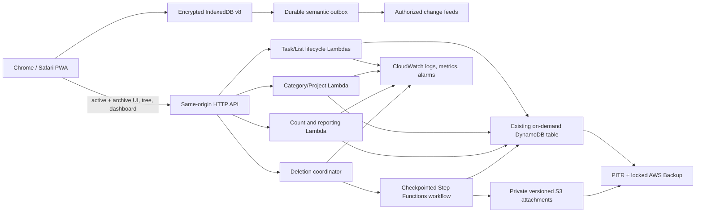

# Implementation Plan: Archive, Projects, and Completion Reporting

**Branch**: `003-archive-project-reporting` | **Date**: 2026-07-24 | **Spec**: [spec.md](./spec.md)

**Input**: Feature specification from `/specs/003-archive-project-reporting/spec.md`

## Summary

Extend Na'aseh's existing TypeScript/React offline-first PWA and serverless AWS backend with
orthogonal completion and archive lifecycles, a two-level Category → Project hierarchy,
authorization-safe workload counts, historical per-user completion reporting, project end
dates, and warned permanent deletion.

Archive remains a state on the authoritative record rather than a copied record. Completing a
to-do atomically archives it and creates a completion event; a List archives by changing its
parent state while its List Items inherit that state. Projects are new versioned entities and
work stores one optional Project reference; Category is resolved from that Project. Counts use
transactional audience-scoped projections online and the same predicate over the encrypted
authorized cache offline. Permanent deletion is online-only, previewed with a short-lived
server token, and completed by an idempotent checkpointed workflow that removes dependents and
publishes tombstones before the browser purges its cache.

### Architecture



## Technical Context

**Language/Version**: TypeScript 5.8 across browser, Node.js 24 Lambda, shared packages, tests,
and AWS CDK; React 19.1

**Primary Dependencies**: Existing React, Vite, Workbox PWA support, Dexie 4, MiniSearch 7,
Zod 3, AWS SDK v3, AWS CDK v2, API Gateway HTTP API, Lambda, Step Functions, DynamoDB,
Amazon S3, AWS Backup, KMS, and `@naaseh/observability`

**Storage**: Existing single on-demand, KMS-encrypted DynamoDB table for current records,
revisions, feeds, mutation receipts, projects, completion events, projections, deletion jobs,
and deletion ledger; encrypted IndexedDB v8 for authorized records, reports, conflicts, and
outbox; existing private versioned SSE-KMS S3 bucket for attachments; DynamoDB PITR and the
existing 35-day compliance-locked AWS Backup plan

**Testing**: Vitest unit/component tests; OpenAPI and sync contract tests; isolated DynamoDB/S3
integration tests; deletion/restore/security/performance suites; Playwright Chromium and
WebKit desktop/iPhone/iPad journeys with accessibility checks

**Target Platform**: Installable responsive web application backed by one `us-west-2`
serverless AWS deployment

**Supported Browsers**: Current stable Chrome and Safari/WebKit, including supported iPhone
and iPad ordinary-tab and installed Home Screen modes

**Project Type**: TypeScript npm-workspace monorepo containing a browser PWA, serverless API,
shared domain/contracts, and AWS infrastructure as code

**Performance Goals**: With 50,000 authorized work records and 1,000 Category/Project nodes,
95% of hierarchy loads, count refreshes, archive searches, report period/filter changes, and
drill-downs show a result or pending acknowledgement within one second; multi-record jobs show
progress after two seconds

**Constraints**: Exactly two hierarchy levels; one optional Project assignment per to-do or
List; no independent Category assignment; Project names unique only within their Category;
hard delete unavailable offline; no public storage; no protected names/content, filter values,
confirmation tokens, or report results in logs; no selective deletion from already locked
backup recovery points

**Offline Strategy**: Archive, restore, completion/reopen, assignment, and hierarchy edits are
semantic, versioned outbox mutations committed atomically with encrypted local state. Project,
Category, and completion-event feeds populate IndexedDB; local counts and dashboard buckets use
only fully synchronized authorized records. Hard delete bypasses the outbox, is disabled
offline, and does not purge local data until the server reports final success or sends an
authorized tombstone. Conflicts remain visible and recoverable unless a confirmed hard delete
must purge the target.

**Security & Data Boundaries**: A single content authorization policy governs task, List,
archive, search, count, report, sync, and attachment access. Exclusive PUBLIC, GROUP, OWNER,
and ADMIN feed/count audiences prevent duplicate aggregation and leakage. Current membership,
owner, lock, privacy, active-user, and explicit reporting privilege are evaluated before reads
or aggregation. Category/Project mutation and hard deletion require administrators; work
lifecycle/deletion retains existing owner permissions. Inaccessible direct resources return
non-disclosing not-found responses.

**AWS Architecture & Cost Impact**: Reuse API Gateway, Lambda, one PAY_PER_REQUEST DynamoDB
table, KMS keys, S3 media, CloudWatch, PITR, and AWS Backup. Add lightweight primary-key count
and drill-down projection rows plus on-demand Step Functions deletion execution; add a second
GSI only if implementation measurements show primary-key adjacency cannot meet an access
pattern. Principal costs are DynamoDB lifecycle/revision/feed/event/projection writes, report
queries, deletion workflow transitions, attachment-version deletes, backup storage, and logs.
The simpler scan-and-filter reporting alternative is retained only for migration verification,
not interactive use, because it cannot reliably meet latency or leakage requirements.

**CloudWatch Observability**: Retain ordinary application logs for 30 days and security/audit
logs for 90 days. Structured allowlisted events record correlation ID, actor ID, resource ID
and type, operation, outcome, latency, safe counts, and error class. Events cover content and
organization lifecycle, completion/reversal, deletion preview/result, report requests,
authorization denial, migration, and restore-ledger enforcement. Metrics and alarms cover
archive/restore failures, completion-event/projection inconsistency, hard-delete failures or
denial spikes, tree/report p95 latency and errors, sync conflicts/backlog, DynamoDB throttling,
and restore-ledger failures.

**Scale/Scope**: Up to 50 provisioned users, 50,000 combined active/archived to-dos, Lists, and
List Items, 1,000 Categories/Projects, 1,000 items per List, and ordinary personal-workspace
completion volume. Revisit projection sharding and report pre-aggregation beyond these bounds.

## Constitution Check

_GATE: Passed before Phase 0 research and re-checked after Phase 1 design._

- **Security and data boundaries — PASS**: Centralized authorization precedes direct reads,
  feeds, counts, reports, archives, and deletion. Audience-scoped projections and tombstones
  prevent aggregate and cache leakage; privileged reads and destructive actions are audited.
- **Data durability and observability — PASS**: Versioned state, revisions, idempotent semantic
  mutations, completion events, transactional projections, checkpointed deletion, PITR/Backup,
  restore-ledger enforcement, actionable errors, structured logs, metrics, and alarms cover
  persistence, retry, recovery, and failure visibility.
- **Browser offline operation and resynchronization — PASS**: Non-destructive operations use
  encrypted IndexedDB/outbox/cursors with visible pending/conflict states. Counts and reports
  remain available from the authorized cache. Hard deletion is explicitly online-only and
  cannot be shown as final prematurely.
- **Supported browsers — PASS**: Responsive tree, archive, warning, end-date, dashboard, and
  filter journeys are planned for Chromium/WebKit desktop, iPhone, and iPad with touch,
  keyboard, screen-reader, and no-horizontal-overflow coverage.
- **Automated testing — PASS**: Domain, component, repository, contract, integration,
  authorization, deletion, migration, backup/restore, performance, Playwright, and
  accessibility coverage is included.
- **Performance and AWS architecture — PASS**: The plan uses managed on-demand services,
  transactional projections, indexed local derivations, measured targets, explicit scale,
  cost drivers, and a no-new-GSI-first approach. No always-on component is introduced.
- **Simplicity, review, comments, and documentation — PASS**: Existing packages, table, feeds,
  cache, media, backup, and consolidated stack are extended. Complexity is confined to
  irreversible multi-record deletion and exact authorization-safe projections.

### Post-Design Re-check

Phase 1 defines orthogonal state machines, parent-governed List archival, scoped Project name
reservations, immutable completion history, audience-scoped projections, online confirmation
tokens, checkpointed purge, local atomic commits, migration checkpoints, and restore-time
deletion-ledger enforcement. Contracts make authorization, concurrency, idempotency, cache
purge, deadline dates, time-zone bucketing, and failure behavior explicit. No unresolved
clarification or unapproved constitutional violation remains.

## Key Technical Decisions

1. Keep archive state on the authoritative entity; never copy records into a second archive.
2. Split task completion from lifecycle so one task can be completed and archived while
   retaining completion attribution; restore/reopen reverses the counted event.
3. Archive a List by changing only its parent; all List Items inherit archive visibility.
4. Add Project as a Category child. Current work stores only `projectId`; Category is resolved
   server-side and Project names use parent-scoped canonical reservations.
5. Preserve each legacy Category and create a deterministic `General` Project beneath it;
   migrate old task assignments to that Project and leave existing Lists unassigned.
6. Unify task and List authorization before building aggregates. Use exclusive PUBLIC, GROUP,
   OWNER, and ADMIN audiences for feeds, count projections, and drill-down pointers.
7. Write completion events and daily UTC source projections transactionally; derive user-local
   day/week/month buckets from event timestamps using validated IANA time zones.
8. Use the same inclusion predicate for count badges and drill-down, both online and offline.
9. Reserve HTTP DELETE for permanent deletion. Require a server preview, bound confirmation
   token, current version, CSRF, and idempotency key; never accept hard delete through sync.
10. Use a checkpointed DeletionJob for arbitrary dependent records. Category/Project deletion
    is blocked unless strongly checked empty and never cascades into work.
11. Retain a content-free deletion ledger and apply it before any restored environment serves
    traffic. Locked backups age out after 35 days but never act as a user recycle bin.
12. Store Project end dates as `YYYY-MM-DD` calendar dates; store completion time as UTC and
    bucket at report time without relying on Temporal support.

## Project Structure

### Documentation (this feature)

```text
specs/003-archive-project-reporting/
├── plan.md
├── research.md
├── data-model.md
├── quickstart.md
├── contracts/
│   ├── openapi.yaml
│   ├── lifecycle-and-deletion.md
│   ├── reporting.md
│   └── sync-protocol.md
└── checklists/
    └── requirements.md
```

### Source Code (repository root)

```text
apps/
├── api/src/
│   ├── categories/
│   ├── projects/
│   ├── lifecycle/
│   ├── reporting/
│   ├── deletion/
│   ├── tasks/
│   ├── lists/
│   ├── sync/
│   └── shared/
└── web/src/
    ├── db/
    ├── features/
    │   ├── admin/
    │   ├── archive/
    │   ├── projects/
    │   ├── reports/
    │   ├── tasks/
    │   └── lists/
    ├── search/
    └── sync/

packages/
├── contracts/src/
├── domain/src/
├── observability/
└── test-fixtures/

infra/
├── lib/
│   ├── api-stack.ts
│   ├── backup-stack.ts
│   ├── deletion-stack.ts
│   ├── global-data-stack.ts
│   └── observability-stack.ts
└── test/

tests/
├── contract/
├── e2e/
├── integration/
├── performance/
├── restore/
└── security/
```

**Structure Decision**: Extend the current npm-workspace monorepo and single regional
deployment. New folders isolate organization, reporting, and deletion policy without creating
a new application, database, or always-on analytics service.

## Delivery Phases

1. **Domain and authorization foundation**: orthogonal lifecycle schemas, Project and
   CompletionEvent entities, shared content policy, sync v3 types, deletion preview/job types.
2. **Server migration and persistence**: deterministic `General` Projects, checkpointed
   task backfill, dual-read/write compatibility, scoped name reservations, revisions and feeds.
3. **Local schema and sync**: Dexie v8 stores/indexes, semantic outbox operations, authorized
   project/event feeds, revocation and hard-delete purges, conflict handling.
4. **Archive and hierarchy UX**: archive routes, finish/restore controls, grouped Project
   picker, accessible two-level admin tree, editing, lifecycle actions, end-date states.
5. **Counts and reporting**: audience projections, shared inclusion predicates, drill-down,
   local/offline counts, daily/weekly/monthly dashboard, filters and historical labels.
6. **Permanent deletion**: server previews/tokens, online-only dialog/client, checkpointed
   work purge, empty-only organization purge, attachment cleanup, receipts and tombstones.
7. **Recovery and hardening**: deletion-ledger restore gate, migration reconciliation,
   authorization matrix, performance/load tests, Chromium/WebKit responsive/offline tests,
   observability/cost review, documentation, and final-diff security review.

## Serverless Cost Review

The design adds no always-on compute. DynamoDB remains on-demand; workload projections add a
bounded set of transactional counter/pointer writes only when work lifecycle, audience, or
assignment changes. The initial completion query deliberately avoids a new GSI and is bounded to
one user and at most 366 local dates; measured latency and consumed-capacity data will determine
whether a user/time GSI later costs less than filtered reads. Scheduled reconciliation is
idempotent and can be reduced in frequency if drift remains zero.

Step Functions is used only for Task/List hard deletion because 1,000 children, attachment
versions, and dependent records require durable checkpoints and retry. Empty Category/Project
deletion stays synchronous. At expected deletion volume, this is safer and cheaper operationally
than reserved compute. The detailed thresholds and alternatives are recorded in
`docs/operations/cost-model.md`.

## Complexity Tracking

| Complexity | Why Needed | Simpler Alternative Rejected Because |
|---|---|---|
| Audience-scoped count and drill-down projection rows | Exact sub-second totals must match authorized records without leaking inaccessible work | Scanning then filtering can exceed the target at 50,000 records and a global pre-count leaks protected existence |
| Checkpointed DeletionJob plus deletion ledger | A List may contain 1,000 items, revisions, events, and attachments—more than one transaction—while deletion must be final, replayable, and safe across restore | A single request cannot atomically delete unbounded dependents; a soft-delete tombstone would create prohibited recycle-bin behavior |
