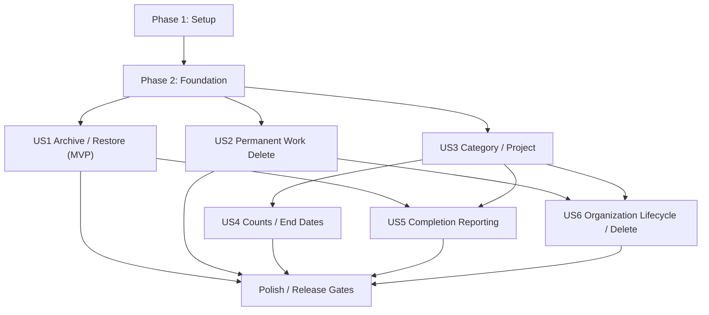

# Tasks: Archive, Projects, and Completion Reporting

**Input**: Design documents from `/specs/003-archive-project-reporting/`

**Prerequisites**: plan.md, spec.md, research.md, data-model.md, contracts/, quickstart.md

**Tests**: Automated unit, integration, contract, security, recovery, performance, and
Playwright Chromium/WebKit tests are required by the project constitution. Within each user
story, create the listed tests first and verify they fail for the intended reason before
implementation.

**Organization**: Tasks are grouped by user story so each increment can be implemented,
validated, and demonstrated independently after the shared foundation is complete.

## Format: `[ID] [P?] [Story] Description`

- **[P]**: Can run in parallel with adjacent independent tasks because it uses different files
  and does not depend on their incomplete work.
- **[Story]**: Maps a task to one of the six user stories in spec.md.
- Every implementation task names the exact repository path it changes.

## Phase 1: Setup (Shared Infrastructure)

**Purpose**: Establish feature-owned folders, fixtures, and contract validation entry points.

- [X] T001 Create feature module directories with index placeholders in apps/api/src/lifecycle/index.ts, apps/api/src/projects/index.ts, apps/api/src/reporting/index.ts, apps/api/src/deletion/index.ts, apps/web/src/features/archive/index.ts, apps/web/src/features/projects/index.ts, and apps/web/src/features/reports/index.ts
- [X] T002 [P] Add shared archive/project/reporting fixture builders and authorization actors in packages/test-fixtures/src/archive-project-reporting.ts and export them from packages/test-fixtures/src/index.ts
- [X] T003 [P] Register the additive v3 OpenAPI artifact and structural validation fixture in packages/contracts/src/archive-project-reporting-openapi.ts and tests/contract/archive-project-reporting-openapi.contract.test.ts

---

## Phase 2: Foundational (Blocking Prerequisites)

**Purpose**: Add shared state, authorization, persistence, synchronization, migration, and
observability foundations required by every story.

**⚠️ CRITICAL**: No user story implementation begins until this phase passes its focused tests.

- [X] T004 [P] Add failing domain tests for orthogonal task lifecycle/completion invariants, Project parent-scoped names, date-only end dates, and CompletionEvent reversal rules in packages/domain/test/archive-project-domain.test.ts
- [X] T005 [P] Add failing authorization matrix tests that cover PUBLIC, GROUP, OWNER/locked, ADMIN, archived, and inactive-user access in packages/domain/test/archive-project-authorization.test.ts
- [X] T006 [P] Add failing sync v3 schema and hard-delete rejection tests in tests/contract/archive-project-sync.contract.test.ts
- [X] T007 Implement Category lifecycle extensions and the Project schema, canonical sibling-name helper, end-date validation, and exports in packages/domain/src/category.ts, packages/domain/src/project.ts, and packages/domain/src/index.ts
- [X] T008 Implement orthogonal completion/lifecycle fields and transition primitives for Task and List while preserving parent-governed List Items in packages/domain/src/task.ts, packages/domain/src/list.ts, and packages/domain/src/revision.ts
- [X] T009 Implement CompletionEvent, DeletionPreview, DeletionJob, and DeletionLedger schemas and state invariants in packages/domain/src/completion-event.ts, packages/domain/src/deletion.ts, and packages/domain/src/index.ts
- [X] T010 Replace divergent task/list read logic with one exclusive-audience authorization policy and current-group evaluation in packages/domain/src/authorization.ts, apps/api/src/shared/content-authorization.ts, apps/api/src/tasks/task-authorization.ts, and apps/api/src/lists/list-authorization.ts
- [X] T011 Extend entity types, semantic mutation operations, version-3 negotiation, stable replay results, and explicit hard-delete rejection in packages/domain/src/sync.ts, packages/contracts/src/openapi.ts, and apps/api/src/sync/sync-service.ts
- [X] T012 Add DynamoDB keys and generic transaction inputs for Projects, CompletionEvents, projections, DeletionJobs, deletion receipts, ledgers, and migration checkpoints in apps/api/src/shared/keys.ts and apps/api/src/shared/store.ts
- [X] T013 Implement Dexie v8 stores/indexes for Projects and CompletionEvents plus task/list lifecycle and Project indexes without decrypting records during upgrade in apps/web/src/db/database.ts and apps/web/src/db/schema.ts
- [X] T014 Preserve v7 encrypted entities, outbox, conflicts, and cursor through the v8 migration and add lazy record normalization in apps/web/src/db/task-repository.ts, apps/web/src/db/list-repository.ts, and apps/web/test/db/archive-project-schema-migration.test.ts
- [X] T015 Extend encrypted outbox routing, pull parsers, atomic cursor commits, authorization purges, and semantic conflict types for Project/CompletionEvent/DeletionJob in apps/web/src/db/outbox.ts, apps/web/src/sync/sync-engine.ts, apps/web/src/sync/privacy-purge.ts, and apps/web/src/sync/conflict-resolution.ts
- [X] T016 Add feature-safe structured telemetry helpers and redaction tests for lifecycle, organization, completion, deletion, reporting, migration, and restore-ledger operations in packages/observability/src/archive-project-reporting.ts and packages/observability/test/archive-project-reporting.test.ts
- [X] T017 Add migration configuration, checkpoint repository, dual-read/write compatibility flags, and safe operational metrics scaffolding in apps/api/src/projects/migration-repository.ts, apps/api/src/projects/migration-config.ts, and infra/lib/config.ts

**Checkpoint**: Domain schemas, centralized authorization, sync v3, Dexie v8, persistence keys,
telemetry, and migration scaffolding are ready; all six story phases may now be developed.

---

## Phase 3: User Story 1 - Finish Work Without Losing It (Priority: P1) 🎯 MVP

**Goal**: Completing a to-do archives it with durable completion credit; finishing a List
archives its aggregate; authorized users can browse and restore archived work online/offline
without permissions or history changing.

**Independent Test**: Complete personal, group, and locked to-dos; finish Lists containing open
and completed Items; verify active/archive views, permissions, parent-governed Items, restoration,
revisions, attachments, offline restart, synchronization, and conflicts.

### Tests for User Story 1

- [X] T018 [P] [US1] Add failing Task complete-and-archive, manual archive, restore/reopen, replay, and event-reversal unit tests in packages/domain/test/task-archive-lifecycle.test.ts
- [X] T019 [P] [US1] Add failing List finish/archive/restore and 1,000-child parent-governed lifecycle unit tests in packages/domain/test/list-archive-lifecycle.test.ts
- [X] T020 [P] [US1] Add failing lifecycle and archive endpoint contract tests, including precondition and non-disclosing error responses, in tests/contract/archive-lifecycle.contract.test.ts
- [X] T021 [P] [US1] Add failing transactional integration tests for Task+revision+CompletionEvent+feed commits and parent-only List archive/restore in tests/integration/archive-lifecycle.test.ts
- [X] T022 [P] [US1] Add failing archive authorization/search/cache tests for owner, group member, revoked member, locked content, administrator, and inactive user in tests/security/archive-authorization.security.test.ts
- [X] T023 [P] [US1] Add failing Chromium/WebKit online, offline-restart, reconnect, conflict, responsive, keyboard, and touch archive journeys in tests/e2e/archive-restore.spec.ts

### Implementation for User Story 1

- [X] T024 [US1] Implement idempotent Task complete-and-archive, manual archive, restore/reopen, revision, CompletionEvent, and audience-feed transactions in apps/api/src/lifecycle/task-lifecycle-service.ts and apps/api/src/tasks/task-repository.ts
- [X] T025 [P] [US1] Implement parent-only List finish, manual archive, restore, revision, and audience-feed transactions in apps/api/src/lifecycle/list-lifecycle-service.ts and apps/api/src/lists/list-repository.ts
- [X] T026 [US1] Implement archive listing/filtering with current authorization and nested List Items in apps/api/src/lifecycle/archive-repository.ts and apps/api/src/lifecycle/archive-service.ts
- [X] T027 [US1] Implement lifecycle/archive HTTP handlers with CSRF, required If-Match, Idempotency-Key replay, Problem Details, and no-store responses in apps/api/src/lifecycle/handlers.ts and apps/api/src/tasks/handlers.ts
- [X] T028 [US1] Register Task/List lifecycle and unified archive routes plus least-privilege DynamoDB grants in infra/lib/api-stack.ts
- [X] T029 [US1] Implement local atomic complete/archive/finish/restore mutations, encrypted archive queries, and pending/conflict state in apps/web/src/db/task-repository.ts, apps/web/src/db/list-repository.ts, and apps/web/src/db/archive-repository.ts
- [X] T030 [US1] Implement searchable active/archive lifecycle metadata and confirmed tombstone removal without exposing inaccessible content in apps/web/src/search/task-index.ts, apps/web/src/search/task-search.ts, and apps/web/src/search/index-migration.ts
- [X] T031 [US1] Build the responsive authorized Archive page, active/archive search scope, nested List display, restore actions, pending status, and accessible empty/error states in apps/web/src/features/archive/ArchivePage.tsx, apps/web/src/features/search/TaskFilters.tsx, and apps/web/src/features/search/search-state.ts
- [X] T032 [US1] Wire complete-and-archive, finish, and restore controls into Task/List pages and application routing in apps/web/src/features/tasks/TaskActions.tsx, apps/web/src/features/lists/ListPage.tsx, apps/web/src/app/router.tsx, and apps/web/src/app/App.tsx

**Checkpoint**: User Story 1 is deployable as the MVP and passes all lifecycle, authorization,
offline, and Chromium/WebKit tests independently.

---

## Phase 4: User Story 2 - Permanently Delete Work Deliberately (Priority: P1)

**Goal**: Owners can preview and permanently delete active/archived Tasks or Lists only after
an authoritative irreversible warning; deletion is online-only, checkpointed, audited,
attachment-aware, and cannot be undone or resurrected by restore.

**Independent Test**: Preview, cancel, stale-confirm, authorize, interrupt, retry, and finish
Task/List deletion; verify every dependent representation disappears only after confirmed
success, offline attempts never appear final, and a pre-delete backup cannot re-expose content.

### Tests for User Story 2

- [X] T033 [P] [US2] Add failing confirmation-token binding, expiry, dependency-digest, version, actor, resource, and idempotent receipt unit tests in packages/domain/test/permanent-deletion.test.ts
- [X] T034 [P] [US2] Add failing preview, DELETE, and DeletionJob status contract tests in tests/contract/permanent-deletion.contract.test.ts
- [X] T035 [P] [US2] Add failing checkpoint interruption/replay tests covering children, revisions, events, projections, feeds, and attachment references in tests/integration/permanent-deletion-workflow.test.ts
- [X] T036 [P] [US2] Add failing unauthorized, stale-token, offline-sync rejection, cross-resource token, logging-redaction, and cache-leak tests in tests/security/permanent-deletion.security.test.ts
- [X] T037 [P] [US2] Add failing attachment-object/version purge and reconciliation tests in tests/integration/permanent-deletion-attachments.test.ts
- [X] T038 [P] [US2] Add failing pre-delete-backup restore and deletion-ledger enforcement tests in tests/restore/permanent-deletion-ledger.test.ts
- [X] T039 [P] [US2] Add failing Chromium/WebKit warning cancel/confirm, offline-disabled, progress, failure, and final purge journeys in tests/e2e/permanent-deletion.spec.ts

### Implementation for User Story 2

- [X] T040 [US2] Implement server-authoritative deletion dependency enumeration, preview shape, blockers, impact counts, digest, and short-lived signed token in apps/api/src/deletion/deletion-preview-service.ts and apps/api/src/deletion/confirmation-token.ts
- [X] T041 [US2] Implement DeletionJob, stable receipt, checkpoint, and content-free ledger persistence in apps/api/src/deletion/deletion-repository.ts
- [X] T042 [US2] Implement Task/List deletion locking, paged dependent purge, projection reversal, audience tombstones, current-record removal, retry, and completion invariants in apps/api/src/deletion/deletion-service.ts and apps/api/src/deletion/workflow-handler.ts
- [X] T043 [US2] Integrate exact attachment-reference/S3-version release and idempotent reconciliation into permanent deletion in apps/api/src/attachments/deletion-service.ts and apps/api/src/attachments/reconciliation-handler.ts
- [X] T044 [US2] Implement preview, confirm, and job-status handlers with owner authorization, CSRF, If-Match, idempotency, no-store, and safe Problem Details in apps/api/src/deletion/handlers.ts
- [X] T045 [US2] Define the on-demand Step Functions deletion workflow, Lambda roles, timeouts, retries, and alarms without always-on capacity in infra/lib/deletion-stack.ts, infra/lib/naaseh-stack.ts, and infra/lib/api-stack.ts
- [X] T046 [US2] Implement restore-time DeletionLedger application as a blocking validation gate before restored data can serve traffic in apps/api/src/crypto-recovery/deletion-ledger-validator.ts, apps/api/src/crypto-recovery/restore-validator.ts, and infra/lib/restore-workflow-stack.ts
- [X] T047 [US2] Implement the online-only deletion client, non-persistent preview token handling, job polling, and atomic confirmed cache/search/conflict purge in apps/web/src/features/archive/deletion-client.ts, apps/web/src/db/deletion-purge.ts, and apps/web/src/sync/sync-engine.ts
- [X] T048 [US2] Build a focus-safe irreversible deletion dialog that names the target/dependencies, distinguishes Cancel/Permanently delete, disables offline, and shows progress/failure in apps/web/src/features/archive/PermanentDeleteDialog.tsx
- [X] T049 [US2] Add delete actions for active/archive Task and List views and prevent edits while a DeletionJob is pending in apps/web/src/features/tasks/TaskActions.tsx, apps/web/src/features/lists/ListPage.tsx, and apps/web/src/features/archive/ArchivePage.tsx

**Checkpoint**: User Story 2 permanently deletes work only after a fresh explicit warning,
with no application recycle path and restore-time resurrection prevention.

---

## Phase 5: User Story 3 - Organize Work by Category and Project (Priority: P1)

**Goal**: Administrators manage a strict two-level Category → Project tree, Project names may
repeat under different Categories, and Tasks/Lists select one Project or Unassigned while
Category is derived.

**Independent Test**: Create PAAO → API/Network and Another Category → API; reject sibling and
third-level conflicts; edit/move Projects; assign/unassign Tasks/Lists; migrate legacy Category
assignments twice without loss or duplicate Projects/events.

### Tests for User Story 3

- [X] T050 [P] [US3] Add failing Category/Project CRUD, scoped-name, move, two-level, date-only, and optimistic-version unit tests in packages/domain/test/category-project-tree.test.ts
- [X] T051 [P] [US3] Add failing Category/Project and Task/List Project-assignment contract tests in tests/contract/category-project.contract.test.ts
- [X] T052 [P] [US3] Add failing repository transaction tests for scoped reservations, move collisions, assignment derivation, and concurrent same-name creation in tests/integration/category-project-repository.test.ts
- [X] T053 [P] [US3] Add failing idempotent General-Project migration, dual-read/write, completed-event synthesis, checkpoint-resume, and reconciliation tests in tests/integration/category-project-migration.test.ts
- [X] T054 [P] [US3] Add failing Project visibility/assignment authorization and non-disclosing direct-access tests in tests/security/category-project-authorization.security.test.ts
- [X] T055 [P] [US3] Add failing Chromium/WebKit admin tree, duplicate API names, move/edit, grouped Project picker, Unassigned, offline queue, conflict, and responsive journeys in tests/e2e/category-project-tree.spec.ts

### Implementation for User Story 3

- [X] T056 [US3] Implement Category/Project repositories with global Category and parent-scoped Project name reservations, conditional rename/move, and current/archived reads in apps/api/src/categories/category-repository.ts and apps/api/src/projects/project-repository.ts
- [X] T057 [US3] Implement Category/Project administration, effective assignability, strict depth, scoped uniqueness, edit/move, and audit services in apps/api/src/projects/project-service.ts and apps/api/src/categories/category-service.ts
- [X] T058 [US3] Implement Category/Project CRUD and Task/List Project-assignment handlers with admin/edit authorization, If-Match, idempotency, CSRF, and derived Category validation in apps/api/src/projects/handlers.ts, apps/api/src/categories/handlers.ts, apps/api/src/tasks/handlers.ts, and apps/api/src/lists/handlers.ts
- [X] T059 [US3] Register Category/Project and assignment routes plus table grants in infra/lib/admin-stack.ts and infra/lib/api-stack.ts
- [X] T060 [US3] Implement deterministic General-Project creation, paged task backfill, synthesized legacy completion events, dual-read/write rollout, checkpoints, and reconciliation in apps/api/src/projects/migration-service.ts and apps/api/src/projects/migration-handler.ts
- [X] T061 [US3] Add the checkpointed migration Lambda, deployment ordering, and restricted permissions in infra/lib/migration-stack.ts and infra/lib/naaseh-stack.ts
- [X] T062 [US3] Implement encrypted local Project storage, Category tree queries, grouped assignment options, and offline Project mutations in apps/web/src/db/project-repository.ts, apps/web/src/db/category-repository.ts, and apps/web/src/sync/sync-engine.ts
- [X] T063 [US3] Replace independent/legacy Category selection with one grouped Project-or-Unassigned control in apps/web/src/features/projects/ProjectPicker.tsx, apps/web/src/features/tasks/TaskForm.tsx, and apps/web/src/features/lists/ListForm.tsx
- [X] T064 [US3] Build the accessible two-level administration tree with create/edit/move forms, archived-state labels, keyboard/touch disclosure, and scoped validation messages in apps/web/src/features/admin/CategoriesAdminPage.tsx, apps/web/src/features/admin/CategoryForm.tsx, and apps/web/src/features/admin/ProjectForm.tsx
- [X] T065 [US3] Add Category/Project API clients, optimistic version handling, offline status, and administrator routing in apps/web/src/features/admin/admin-client.ts, apps/web/src/app/router.tsx, and apps/web/src/app/App.tsx
- [X] T066 [US3] Update Task/List search documents and filters to derive Category through Project and expose Unassigned without retaining legacy conflicting assignment fields in apps/web/src/search/task-index.ts, apps/web/src/search/task-filters.ts, and apps/web/src/features/search/TaskFilters.tsx

**Checkpoint**: User Story 3 provides a complete two-level hierarchy, migration, and assignment
workflow without requiring counts/reporting or organization lifecycle actions.

---

## Phase 6: User Story 4 - See Workload Counts and Project End Dates (Priority: P2)

**Goal**: Every visible Project shows separate active to-do/List counts and its end-date state;
Category counts roll up visible Projects, Unassigned is explicit, and every count matches its
authorized drill-down.

**Independent Test**: Seed accessible/inaccessible active, archived, deleting, and Unassigned
work across dated Projects; verify Project direct counts, Category roll-ups, deadline states,
drill-down equality, offline calculation, reconciliation, and the one-second target.

### Tests for User Story 4

- [X] T067 [P] [US4] Add failing shared-inclusion, Category roll-up, Unassigned, deadline-state, and date-only time-zone unit tests in packages/domain/test/workload-counts.test.ts
- [X] T068 [P] [US4] Add failing organization-tree response and canonical drill-down contract tests in tests/contract/organization-tree.contract.test.ts
- [X] T069 [P] [US4] Add failing transactional projection increment/decrement/transfer/replay and reconciliation integration tests in tests/integration/workload-projections.test.ts
- [X] T070 [P] [US4] Add failing count/timing leakage tests across PUBLIC, GROUP, OWNER, ADMIN, revoked, and inaccessible scopes in tests/security/workload-counts.security.test.ts
- [X] T071 [P] [US4] Add failing 50,000-work/1,000-node tree, count, and drill-down performance tests in tests/performance/organization-tree.test.ts
- [X] T072 [P] [US4] Add failing Chromium/WebKit counts, drill-down, end-date, overdue, offline, touch, keyboard, and no-overflow journeys in tests/e2e/project-workload.spec.ts

### Implementation for User Story 4

- [X] T073 [US4] Implement the shared workload inclusion predicate, exclusive audience selection, Project/Category/Unassigned keys, and deadline-state helper in packages/domain/src/workload.ts and packages/domain/src/project.ts
- [X] T074 [US4] Implement transactional workload counter and drill-down pointer adjustments for Task/List create, assignment, archive, restore, audience change, and deletion in apps/api/src/reporting/workload-projection-repository.ts and apps/api/src/shared/store.ts
- [X] T075 [US4] Implement authorization-first organization tree, Category roll-up, Unassigned counts, as-of consistency, and exact drill-down services in apps/api/src/reporting/organization-tree-service.ts and apps/api/src/reporting/handlers.ts
- [X] T076 [US4] Register organization-tree routes and add projection latency/error/drift metrics and alarms in infra/lib/api-stack.ts and infra/lib/observability-stack.ts
- [X] T077 [US4] Implement scheduled idempotent projection reconciliation, safe drift repair, and operational metrics in apps/api/src/reporting/projection-reconciliation-handler.ts and infra/lib/reporting-stack.ts
- [X] T078 [US4] Implement one-pass authorized local Project/Category/Unassigned count selectors and shared drill-down predicates in apps/web/src/db/workload-selector.ts and apps/web/src/features/projects/useWorkloadTree.ts
- [X] T079 [US4] Add separate to-do/List badges, exact drill-down links, date/upcoming/today/overdue states, remaining total, as-of/pending indicators, and accessible mobile layout in apps/web/src/features/projects/ProjectTree.tsx, apps/web/src/features/projects/ProjectStatus.tsx, and apps/web/src/styles/app.css

**Checkpoint**: User Story 4 produces exact authorization-safe operational counts and Project
deadline visibility online and offline.

---

## Phase 7: User Story 5 - Review Personal Completion Statistics (Priority: P2)

**Goal**: Users see daily, weekly, and monthly Task completion totals in their local time zone,
filter by Unassigned/Category/Project including archived organization, and retain historical
completion-time attribution through archive or reassignment.

**Independent Test**: Complete, reopen, re-complete, archive, restore, reassign, move Projects,
and hard-delete fixtures across DST/day/week/month boundaries; verify personal and privileged
reports, filters, historical labels, offline parity, and no protected aggregate leakage.

### Tests for User Story 5

- [X] T080 [P] [US5] Add failing CompletionEvent counted/reversed/re-completed and historical-scope unit tests in packages/domain/test/completion-reporting.test.ts
- [X] T081 [P] [US5] Add failing IANA time-zone, DST overlap/gap, week-start, month/year, zero-fill, and total-equality unit tests in apps/web/test/features/completion-bucketing.test.ts
- [X] T082 [P] [US5] Add failing completion-report query/filter/privileged-user contract tests in tests/contract/completion-reporting.contract.test.ts
- [X] T083 [P] [US5] Add failing completion/reversal/projection transaction and historical attribution integration tests in tests/integration/completion-reporting.test.ts
- [X] T084 [P] [US5] Add failing inaccessible-event, archived-scope, aggregate/timing leakage, and telemetry-redaction tests in tests/security/completion-reporting.security.test.ts
- [X] T085 [P] [US5] Add failing 50,000-event day/week/month/filter performance tests in tests/performance/completion-reporting.test.ts
- [X] T086 [P] [US5] Add failing Chromium/WebKit dashboard period, time-zone, Category/Project, Unassigned, archived filter, offline/pending, responsive, keyboard, and touch journeys in tests/e2e/completion-dashboard.spec.ts

### Implementation for User Story 5

- [X] T087 [US5] Implement CompletionEvent create/reversal/current-event lookup and historical Project/Category snapshot persistence in apps/api/src/reporting/completion-event-repository.ts and apps/api/src/lifecycle/task-lifecycle-service.ts
- [X] T088 [US5] Implement bounded completion projection/query, IANA-zone validation, day/week/month bucketing, zero-fill, historical/current-location difference, and hard-delete reversal in apps/api/src/reporting/completion-report-service.ts
- [X] T089 [US5] Implement personal/privileged completion-report handlers with authorization-first filters, no-store responses, safe errors, and redacted telemetry in apps/api/src/reporting/handlers.ts and apps/api/src/reporting/telemetry.ts
- [X] T090 [US5] Register completion-report routes, least-privilege reads, latency/error metrics, and alarms in infra/lib/api-stack.ts and infra/lib/observability-stack.ts
- [X] T091 [US5] Implement encrypted local CompletionEvent repository, counted-event selector, hard-delete removal, and server/offline parity checks in apps/web/src/db/completion-event-repository.ts
- [X] T092 [US5] Implement Safari-compatible IANA date bucketing with Intl.DateTimeFormat.formatToParts, persisted time-zone/week-start preferences, and deterministic zero-filled periods in apps/web/src/features/reports/completion-bucketing.ts and apps/web/src/db/preferences-repository.ts
- [X] T093 [US5] Build the accessible Dashboard with day/week/month controls, Category/Project/Unassigned filters, archived labels, totals, pending/last-sync state, and responsive visualization in apps/web/src/features/reports/CompletionDashboard.tsx, apps/web/src/features/reports/CompletionFilters.tsx, apps/web/src/app/router.tsx, and apps/web/src/styles/app.css

**Checkpoint**: User Story 5 provides durable, historically correct, authorization-safe
completion reporting with server/offline parity across supported time zones and browsers.

---

## Phase 8: User Story 6 - Archive or Permanently Delete Categories and Projects (Priority: P2)

**Goal**: Administrators archive/restore editable Categories and Projects without losing
statistics or permissions and permanently delete only truly empty nodes after an authoritative
irreversible warning.

**Independent Test**: Archive/restore populated parent/child combinations, edit archived nodes,
reject assignments while effectively archived, preserve reports, preview blocked deletion,
empty all references, permanently delete, and verify scoped-name reuse and audit behavior.

### Tests for User Story 6

- [X] T094 [P] [US6] Add failing Category/Project archive/effective-availability/restore/edit/empty-delete state tests in packages/domain/test/organization-lifecycle.test.ts
- [X] T095 [P] [US6] Add failing organization lifecycle, deletion-preview, blockers, and permanent DELETE contract tests in tests/contract/organization-lifecycle.contract.test.ts
- [X] T096 [P] [US6] Add failing parent archive, child state preservation, edit, restore, emptiness race, name-reservation removal, and replay integration tests in tests/integration/organization-lifecycle.test.ts
- [X] T097 [P] [US6] Add failing administrator-only mutation, archived permission preservation, blocked-reference disclosure, audit-redaction, and cache-purge tests in tests/security/organization-lifecycle.security.test.ts
- [X] T098 [P] [US6] Add failing Chromium/WebKit archive/restore/edit, effective assignment block, warning, blocker, empty delete, offline conflict, keyboard, touch, and responsive journeys in tests/e2e/organization-lifecycle.spec.ts

### Implementation for User Story 6

- [X] T099 [US6] Implement Category/Project archive, restore, archived edit, effective child availability, assignment rejection, and current-permission preservation in apps/api/src/projects/organization-lifecycle-service.ts
- [X] T100 [US6] Implement strong empty-reference queries across children, active/archive work, CompletionEvents, projections, and pending jobs plus atomic entity/name-reservation hard delete in apps/api/src/projects/organization-deletion-service.ts and apps/api/src/projects/project-repository.ts
- [X] T101 [US6] Extend authoritative deletion previews/tokens and content-free receipts for Category/Project blockers and direct empty deletion in apps/api/src/deletion/deletion-preview-service.ts and apps/api/src/deletion/deletion-repository.ts
- [X] T102 [US6] Implement administrator lifecycle/preview/DELETE handlers with CSRF, If-Match, idempotency, non-disclosing errors, safe blocker summaries, and audit events in apps/api/src/projects/handlers.ts and apps/api/src/categories/handlers.ts
- [X] T103 [US6] Register organization lifecycle/deletion routes and add admin-change/delete-blocked/failure metrics and alarms in infra/lib/admin-stack.ts and infra/lib/observability-stack.ts
- [X] T104 [US6] Implement offline archive/restore/edit mutations, effective assignment availability, lifecycle conflicts, and confirmed organization tombstone purge in apps/web/src/db/project-repository.ts, apps/web/src/db/category-repository.ts, and apps/web/src/sync/sync-engine.ts
- [X] T105 [US6] Add Edit/Archive/Restore/Delete actions, effective-state explanations, server blocker display, and permanent warning integration to the admin tree in apps/web/src/features/admin/CategoriesAdminPage.tsx, apps/web/src/features/admin/ProjectForm.tsx, and apps/web/src/features/archive/PermanentDeleteDialog.tsx
- [X] T106 [US6] Preserve archived Category/Project options and historical labels in report filters while preventing new assignments in apps/web/src/features/reports/CompletionFilters.tsx and apps/web/src/features/projects/ProjectPicker.tsx

**Checkpoint**: All six user stories are independently functional; organization lifecycle
retains history and access while hard deletion remains empty-only and irreversible.

---

## Phase 9: Polish & Cross-Cutting Quality Gates

**Purpose**: Validate the integrated feature against performance, browser, security, recovery,
observability, cost, documentation, and final-review requirements.

- [X] T107 [P] Document archive/restore, hierarchy administration, dashboard use, permanent-delete semantics, and accessibility behavior in README.md and docs/user/archive-project-reporting.md
- [X] T108 [P] Document migration rollout/rollback/reconciliation and General-Project mapping operations in docs/operations/archive-project-migration.md
- [X] T109 [P] Document DeletionJob recovery, attachment reconciliation, 35-day locked-backup boundary, and restore-ledger gate in docs/operations/permanent-deletion.md and docs/operations/restore-runbook.md
- [X] T110 Add end-to-end fixture coverage tying archive, deletion, hierarchy, counts, reporting, and organization lifecycle together in packages/test-fixtures/src/archive-project-reporting.ts and tests/e2e/archive-project-reporting-full.spec.ts
- [X] T111 Run and tune the 50,000-work/1,000-node/50,000-event performance suite to meet one-second acknowledgement targets and record results in tests/performance/archive-project-reporting.test.ts and docs/operations/performance.md
- [X] T112 Validate Chromium/WebKit desktop, iPhone, and iPad keyboard/touch/screen-reader/no-overflow behavior and close gaps in tests/e2e/archive-project-reporting-responsive.spec.ts and apps/web/src/styles/app.css
- [X] T113 Validate offline restart, reconnect, v2→v3 migration, revocation purge, lifecycle conflicts, and online-only deletion across Chromium/WebKit in tests/e2e/archive-project-reporting-offline.spec.ts
- [X] T114 Complete the final authorization/data-boundary negative matrix for direct access, search, feeds, counts, reports, archive, attachments, deletion, and caches in tests/security/archive-project-reporting-boundaries.security.test.ts
- [X] T115 Execute backup/restore, deletion-ledger, migration-reconciliation, projection-reconciliation, attachment-integrity, and failure-alarm drills and capture expected evidence in tests/restore/archive-project-reporting-restore.test.ts and docs/operations/restore-runbook.md
- [X] T116 Validate CloudWatch allowlisted detail, protected-data exclusions, 30/90-day retention, metrics, alarms, dashboard widgets, and expected log cost in infra/test/archive-project-observability.test.ts and infra/lib/observability-stack.ts
- [X] T117 Review serverless AWS usage, Step Functions necessity, DynamoDB projection write cost, no-new-GSI-first measurements, scaling assumptions, and cheaper alternatives in specs/003-archive-project-reporting/plan.md and docs/operations/cost-model.md
- [X] T118 Run quickstart.md and the full npm run validate, npm run test:e2e, npm run test:performance, npm run validate:pre-aws gates; then re-review the final diff for correctness, complexity, security, durability, errors, logging, comments, tests, browsers, and documentation using specs/003-archive-project-reporting/quickstart.md

---

## Dependencies & Execution Order

### Phase Dependencies

- **Phase 1 — Setup**: No dependencies; T002 and T003 may run in parallel after T001 or in
  already-existing paths.
- **Phase 2 — Foundation**: Depends on Phase 1 and blocks every user story. Write T004–T006
  first, then complete T007–T017 in dependency order.
- **Phase 3 — US1**: Depends on Foundation only and is the recommended MVP.
- **Phase 4 — US2**: Depends on Foundation; integrates with US1 archive/search UI when present,
  but its preview/job/API can be tested with seeded active/archived fixtures independently.
- **Phase 5 — US3**: Depends on Foundation; its CRUD, migration, and assignment workflows are
  independent of counts/reporting.
- **Phase 6 — US4**: Depends on Foundation plus Project identities from US3 for full UI. Its
  projection service can be built against fixtures in parallel with late US3 UI work.
- **Phase 7 — US5**: Depends on Foundation plus CompletionEvent creation from US1 and Project
  identities from US3; report calculation/UI is independently testable with seeded events.
- **Phase 8 — US6**: Depends on US3 organization persistence and uses US2 confirmation
  primitives; it should follow both to avoid duplicating lifecycle/delete policy.
- **Phase 9 — Polish**: Depends on every story selected for release.

### User Story Dependency Graph



### Within Each User Story

1. Create the story's required tests and confirm focused failure.
2. Implement domain/repository behavior before services.
3. Implement services before HTTP handlers and routes.
4. Implement local persistence/sync before UI actions that depend on it.
5. Pass unit → contract → integration/security → Playwright/performance tests.
6. Stop at the checkpoint and validate the story independently.

## Parallel Execution Examples

### User Story 1

```text
Parallel test batch: T018, T019, T020, T021, T022, T023
Parallel implementation after Task lifecycle primitives: T025 (List server lifecycle) and T030 (search lifecycle indexing)
```

### User Story 2

```text
Parallel test batch: T033, T034, T035, T036, T037, T038, T039
Parallel implementation after deletion repository: T043 (attachment purge), T046 (restore-ledger gate), T048 (dialog)
```

### User Story 3

```text
Parallel test batch: T050, T051, T052, T053, T054, T055
Parallel implementation after API schemas: T060 (migration service), T062 (local Project repository), T063 (Project picker)
```

### User Story 4

```text
Parallel test batch: T067, T068, T069, T070, T071, T072
Parallel implementation after projection keys: T077 (reconciliation), T078 (offline selectors), T079 (tree UI)
```

### User Story 5

```text
Parallel test batch: T080, T081, T082, T083, T084, T085, T086
Parallel implementation after CompletionEvent contract: T088 (server reports), T091 (local repository), T092 (browser bucketing)
```

### User Story 6

```text
Parallel test batch: T094, T095, T096, T097, T098
Parallel implementation after organization lifecycle service: T101 (preview integration), T104 (offline lifecycle), T105 (admin UI)
```

## Implementation Strategy

### MVP First

1. Complete Setup T001–T003.
2. Complete Foundation T004–T017.
3. Complete User Story 1 T018–T032.
4. Stop and validate archive/restore independently across permissions, offline restart,
   Chromium, and WebKit.
5. Deploy/demo this archive-preserving completion increment if the full foundation migration
   remains backward compatible.

### Incremental Delivery

1. **MVP**: US1 preserves completed work in an authorized global archive.
2. **Safety increment**: US2 adds deliberate irreversible work deletion and recovery controls.
3. **Organization increment**: US3 adds the two-level tree, migration, and assignment.
4. **Planning increment**: US4 adds exact workload counts and end-date visibility.
5. **Insight increment**: US5 adds personal and authorized historical completion reporting.
6. **Administration increment**: US6 completes Category/Project lifecycle and empty-only delete.
7. Complete Phase 9 before production release of the full feature.

### Parallel Team Strategy

After the Foundation is green, separate owners can develop US1, US2, and US3 concurrently.
US4 and US5 can begin their tests/selectors against fixtures while US3 finishes UI integration.
US6 follows the shared deletion and organization primitives. Avoid concurrent edits to
`infra/lib/api-stack.ts`, `apps/api/src/reporting/handlers.ts`, `apps/web/src/app/App.tsx`, and
`apps/web/src/styles/app.css` without explicit coordination.

## Notes

- `[P]` marks only tasks that can proceed without editing the same incomplete files.
- User-story labels provide traceability to spec.md acceptance scenarios.
- Keep hard delete out of the offline outbox; never make a pending operation look final.
- Treat locked backup recovery points as infrastructure recovery material, not a user recycle
  bin; the DeletionLedger gate is mandatory before restored traffic.
- Add comments for non-obvious authorization, atomicity, purge, date-only, migration, and
  browser-workaround invariants; do not restate obvious code.
- Commit after each task or small coherent group, and re-run the nearest focused tests.
